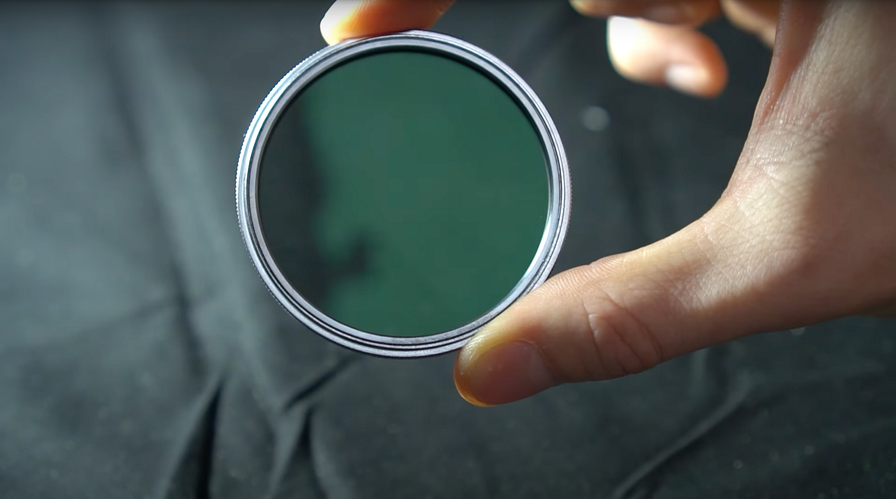

# 三維捕捉的交叉偏振

>[!WARNING]
>
> 自 Sampler 5.1 版本起，已移除對 3D 捕捉的支援。

## 交叉極化

在這份使用指南中，我們將說明如何處理反光物體及其造成的問題，以及如何利用光偏振來解決這些問題。

你比較喜歡透過影片教學來學習這個主題嗎？ 在這裡[&#128279;](https://youtu.be/VWsbP56MDk0?si=Hdp7vblJB6L1RPxK "交叉極化教學")找到。

當光線照射到表面時，通常會以漫反射的方式反射，均勻反射，讓表面呈現出其顏色。 但根據表面粗糙度，有些光線可能會直接反射到你的眼睛或相機方向。 這種 <b>鏡面反射會</b> 根據你的觀察角度而改變。

攝影測量是透過將照片間的視覺圖案和元素對齊來運作，它假設物件的外觀不會在每張相接的照片之間改變。 所以，鏡面反射在這裡是一種不受歡迎的現象。 輕微的物件可能只有反光塗層，但金屬物件則更棘手，且需要更多努力才能解決。 我們將在這份使用手冊中探討輕微的情況。 我們只要捕捉到完美的底色，不被高光高光破壞。 捕捉到後，在3D中很容易再加回反射光。

為了解決這個問題，我們可以用一種稱為 <b>交叉偏振</b>的方法來過濾鏡面反射。 當光被偏振時，所有波的方向都相同。 如果你再偏振一次，且方向垂直，它會完全被阻擋，變得隱形。

偏振主要影響鏡面光，因為鏡面光是聚焦光線，沿著特定方向傳播，而非我們希望保留的散射漫射光。

你用偏振濾鏡來偏振光線，這是一種特殊的透明片，能過濾波形。 它們有多種形式，我們會用旋式玻璃濾鏡來安裝鏡頭，還有DIY風格的偏光底片

基本概念是為 <b>你的光</b>線和 <b>鏡頭</b>加裝濾光片，並將它們設置成 <b>垂直</b>排列。 這表示你需要透過旋轉濾波器來微調濾波器的方向。 一旦設置好，光線反射的鏡面反射就會變得隱形。 看到旋轉濾鏡就能突然完全消除偏振光的眩光，這真的很特別。

應該買一個偏光濾鏡，因為你想要最佳光學效果，同時還能拍出清晰銳利的照片。 不同鏡頭的螺紋尺寸不同，所以要確保選對你喜歡的鏡頭，或者如果想嘗試，可以買幾個尺寸適合多顆鏡頭。

偏光燈比較便宜也簡單：<b> 偏光底片</b> 相對便宜。 你可以用整張紙，也可以剪出一塊。 剪成圓形片覆蓋整個燈光是個好主意，這樣旋轉會更容易。 有些燈具比較適合這個，可能有小濾網架或磁鐵用來固定床單。 如果不行，膠帶總是有效！

記得在使用擴散器</b>後再<b>加偏光片，因為擴散光線會抵消偏振效果。

大多數便宜的環形閃光燈都是鎖在濾鏡槽裡，可能已經無法再裝鏡頭濾鏡了。 而且他們也沒有辦法把偏光濾鏡裝在手電筒上，所以你得自己做一個。 只有頂級機型才能正常支援這功能。

<b>在你的整個裝置中旋轉並匹配偏振片必須持續</b>進行。 你的鏡頭濾鏡必須完全垂直於所有燈光，唯一的方法是看相機螢幕並調整。 我喜歡先用膠帶貼在閃光燈上，然後調整鏡頭濾鏡來阻擋閃光燈的反射。 你只能透過拍照或乾點閃光燈來做到這點。 這有點複雜，你可以用記號筆在鏡頭濾鏡上標記正確的方向，然後盡量不要再碰鏡頭和閃光燈濾鏡。

調整影片燈的偏振則不同，但更簡單。 你必須不斷調整燈光，無論是移動還是調整鏡頭高度。 只要 <b>把紙張旋轉到在相機螢幕</b>上看起來就好。

<b>每個反射中出現的光源都需要偏振</b>，所以你可能需要關窗或關掉螢幕。

只要設定得當，你應該能捕捉到一個物件，彷彿它是完全遮罩的，沒有反光甚至光線。 就像只套用底色材質看到你的網格一樣，它能讓你捕捉困難的反光物件。

現在就了解如何 [使用 Substance 3D Sampler](processing-advanced-3d-captures.md) 處理你的 3D 擷取！
