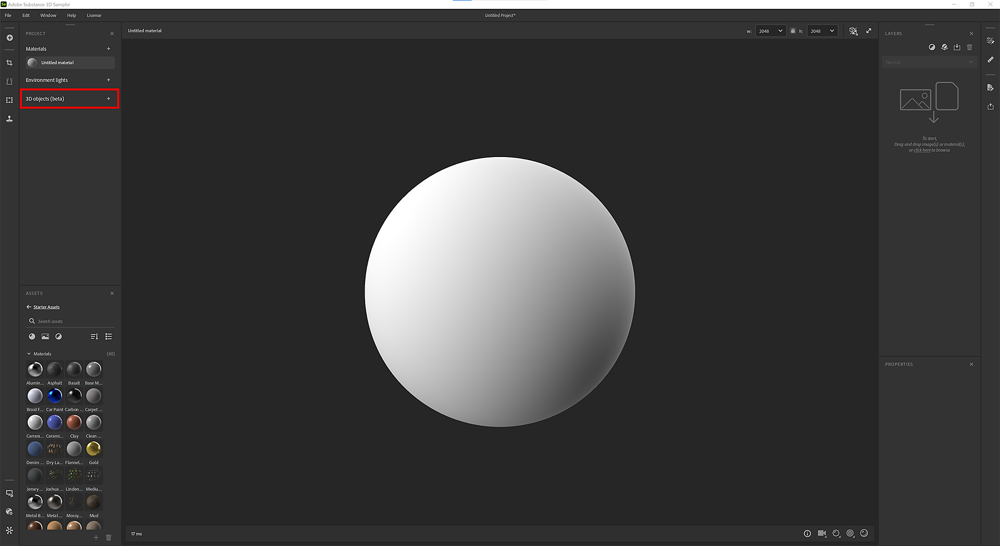
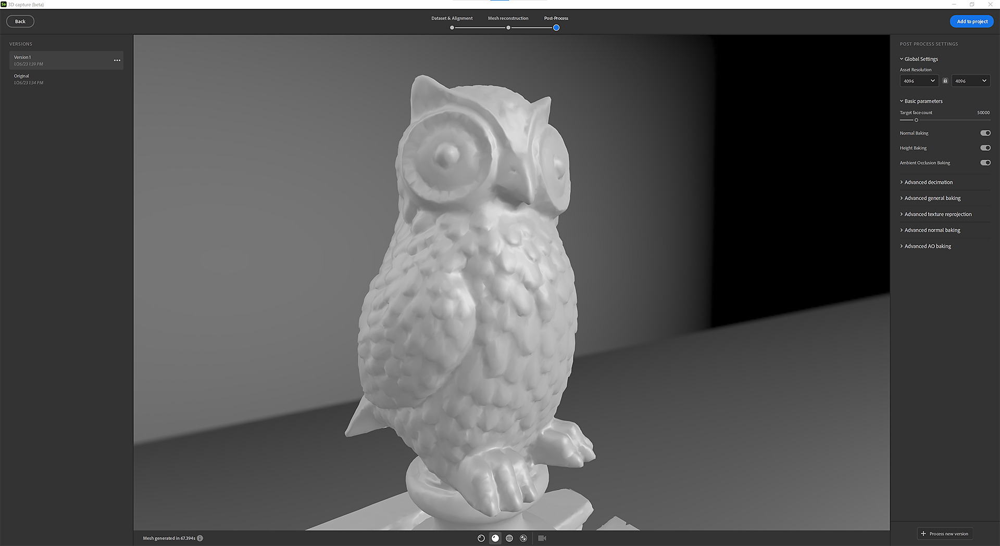

# 3D 擷取

## 入門

## 什麼是攝影測量？

Sampler 利用攝影測量技術將影像轉換成帶有紋理的網格。 攝影測量是從影像進行測量的科學。 它用於從照片中提取資訊，製作 3D 模型與材質。 此過程涉及從不同角度拍攝多張物體照片，然後處理影像以提取影像中特徵的形狀與位置資訊。

目標是將影像間對應的特徵匹配，以確定相機在每張影像中的相對位置。 根據匹配的特徵，重建物體的3D模型。 最後一步是將貼圖投影到3D模型上。

## 硬體需求

3D 擷取功能可在 Windows 及 MacOS、Monterey 或 Ventura 上使用。

Windows/Linux

我們建議：

* 配備 8GB VRAM 的 GPU
* 16GB 記憶體。 理想狀況是 32GB 和 64Gb。
* 至少 10GB 的磁碟空間

[Linux 配置](https://helpx.adobe.com/tw/substance-3d/unlisted/documentation/sadoc/3d-capture-set-up-on-linux-255426606.html)

麥克

* 強烈建議使用 Apple Silicon 裝置（M1 或 M2）。
* 基於 Intel 與 AMD 的 GPU，至少支援 4GB VRAM 與光線追蹤

## 開始新的 3D 擷取

## 匯入你的資料集

## 資料集準備

拖放你的照片，或點擊瀏覽作業系統檔案總管。

>[!NOTE]
>
> **資料集建議**
> 
> 我們建議資料集至少包含 <b>20 張影像</b> ，才能讓 3D 擷取順利進行。

對於 iPhone 用戶，請 。HEIC 格式尚未支援。 你可以用 Lightroom 轉換成 .jpeg。

在 MacOS 上，你可以用 [快速動作](https://support.apple.com/en-gb/guide/mac-help/mchl97ff9142/mac) 轉換圖片。

對於相機的 RAW 格式，我們建議使用 Lightroom 將照片轉換成.jpeg。

>[!NOTE]
>
> **資料集限制**
> 
> **Windows**：你的資料集總數必須小於 6G（6,000,000,000 像素）。 它代表了 500 張 12M 像素的照片

照片匯入後，你可以點擊照片完整觀看。

光群定義：

你的資料集可以被拆分成幾個光組。 照片組依屬性（感光元件尺寸、焦距、旋轉度,...）分組照片。

## 遮蔽

使用口罩有許多優點。 它允許攝影測量過程偵測特徵，並僅重建未遮罩區域。

這也允許在拍攝過程中移動物件，因為遮罩會隱藏所有照片中的背景。

要使用遮罩，請選擇一個照片群組，並打開右側的 **遮罩** 標籤。

你可以透過遵守命名規則來匯入遮罩：

* [image\_name].file\_extension
* [image\_name]\_mask.file\_extension

你可以利用我們的 AI 技術，透過照片自動生成遮具。

## 路線

對齊是為了處理所有影像，擷取並匹配對應特徵，以確定相機在每張影像中的相對位置。

## 設定

精度

有兩種選擇，低價和高價。

* 低：建議大多數資料集使用。
* 高：增加點數，建議在主體質地不足或照片較小時匹配更多照片。 這個設定會讓處理速度變慢。 我們建議你先嘗試低價選項。

照片訂購

有兩個選項，預設和順序。

這可以透過不同的特徵匹配演算法來計算：

* 預設：選擇基於多項標準，其中包括圖片間的相似性。
* 序列：僅使用指定距離內的鄰近影像，若預設模式失敗，建議處理單一照片序列。 照片插入順序必須與序列順序相符。

## 點雲與相機位置

對準步驟的結果是一個稀疏的點雲，所有特徵都被偵測到，所有相機的位置也都已被偵測到。

如果影像輪廓是綠色，表示影像已正確對齊。

若影像輪廓為橘色，表示影像未正確對齊，且未從此影像擷取任何特徵。

你可以點擊左側面板的圖片，來構圖對應相機上的點雲。

你可以點擊相機來框定點雲的畫面。

## 重建

重建步驟會根據匹配的特徵產生物件的 3D 模型，並將紋理投影到該 3D 模型上。

## 背景設定

幾何細節此選項指定輸入照片的精度等級，導致計算出的3D模型細節有所增加或更少。

## 關注區域

在產生 3D 模型之前，你可以設定區域以圍繞點雲重建，並使用包圍框。

你可以在三軸上平移、縮放和旋轉盒子。

按 Shift 鍵同時縮放，你就會從中心縮放盒子。

<table>
<tr style="border: 0;">
<td style="border: 0;" valign="top">

</td>
<td style="border: 0;" valign="top">

</td>
</tr>
</table>

## 後處理

後製能幫助你根據需求和使用方式調整並優化網格和材質。

重建結果可以產生包含數百萬個多邊形和多達 16K 個貼圖的網格。 這通常不會針對渲染、即時或 AR 體驗進行優化。

你需要後製處理結果，以減少多邊形數量同時不損失細節。

後處理步驟自動完成四個步驟：

* Decimation：透過定義你想要的面數來減少多邊形數量
* UV 展開：自動定義接縫、展開並包裝被毀壞網格的 UV
* 重投影：將攝影測量網格的色彩紋理重新投影到已毀滅的網格上
* 烘焙：將攝影測量網格的法線、高度和 AO 細節烘焙到已毀滅的網格上。 這樣可以確保在減量過程中遺失的所有網格細節都轉到貼圖中。

## 版本

為了方便迭代和測試不同的後製選項，你可以建立多個版本，然後選擇一個加入你的專案。

為了幫助你，你可以用不同模式來視覺化網格。

固態模式

線框模式

UV 網格模式

## 非破壞性工作流程

一旦新增版本，便會建立由多個層組成的層堆疊。

第一層是重建結果。

第二層（如果你有做後製處理）是網格後製層，裡面有 3D 捕捉視窗中定義的數值。 如果你想用其他設定，這階段還是可以編輯參數。

第三層是網格變換層，用來縮放、平移和旋轉你的 3D 物件。

在這個階段，你可以加裝你慣用的材質濾鏡，來編輯 3D 物件的貼圖。

## 匯出

在匯出視窗中，你可以設定網格格式和材質設定（匯出材質時設定相同）。

## 教學課程

[前往進階教學](https://substance3d.adobe.com/tutorials/courses/Advanced-3D-Capture/youtube-f8iCtZ3Gmzs)

## 常見問題

**攝影測量的最佳捕捉條件是什麼？**

為了讓攝影測量產生準確的結果，拍攝影像時遵循某些最佳實務非常重要。

1. 光線：攝影測量在良好光線條件下拍攝時效果最佳。 避免在低光或高對比度光線下拍攝，因為這些會讓影像中難以準確提取特徵。 攝影測量的最佳光線條件是陰天或有遮蔭的區域。
1. 重疊：為確保影像中有足夠資訊以準確萃取特徵，捕捉重疊顯著的影像非常重要。 一般的經驗法則是，影像之間至少有60%的重疊，無論橫向還是縱向。
1. 相機：使用高解析度相機和鏡頭，且影像品質和銳利度良好。 避免使用魚眼鏡頭或廣角鏡頭的相機，因為這可能導致幾何變形，進而影響最終效果。
1. 方向：拍攝時，盡量保持相機水平且垂直於地面。 以斜角度拍攝的影像會讓準確提取特徵變得困難，並可能導致結果失真。
1. 相機校正：拍攝前務必確保相機已校正。 此過程可修正鏡頭畸變及其他可能影響最終結果準確度的誤差。

**它對鏡面和反射物體是怎麼運作的？**

攝影測量在處理高度鏡面或反光物體時可能具有挑戰性，因為明亮的反射會使得從影像中提取特徵變得困難。 以下是一些可用來克服這些挑戰的策略：

1. 光線：拍攝高反射物體時，盡量避免直射陽光，並在陰天或陰影條件下拍攝。 這有助於降低反射強度，並更容易從影像中提取特徵。
1. 霧面處理：在反光表面塗抹霧面處理，有助於降低反射強度，並更容易從影像中提取特徵。
1. 擷取多個影像：從不同角度擷取同一物件的多個影像，有助於減少反射的影響，並增加從至少一些影像擷取特徵的機率。
1. 影像編輯：在後處理中，某些影像編輯軟體（例如Lightroom）可以用來減少反射並增強影像中的特徵，例如增加對比度或色彩校正。

請記住，反光對象可能需要更細緻的設定和處理，不可能在所有情況下都獲得完美的結果。 嘗試不同的技術是一個好主意。

**行動電話和DSLR攝影機之間有什麼像片測量建議？**

行動電話和DSLR相機都可用於攝影測量，但它們的優點和缺點不同。 決定使用哪種相機時，請考量以下幾點：

1. 解析度：DSLR相機通常比手機解析度高很多，因此可以產生更詳細和精確的結果。 然而，隨著手機照相機的發展，一些高端手機照相機的解析度和影象品質與一些低端DSLR照相機相當。
1. 相機標定：攝影測量需要精確的相機標定，通常使用手機相機比使用DSLR相機更難實現。 有些手機相機具有內建的校準引數，您可以使用這些引數，但是其校準可能不如正確的DSLR相機精確。
1. 電池續航力與儲存能力：與DSLR相機相比，行動電話相機的電池續航力更有限。 因此，您必須在工作時計畫為手機充電或攜帶額外的電池。 此外，您需要確保電話有足夠的儲存容量來處理大型映像檔案。
1. 成本：DSLR相機通常比行動電話更昂貴，並且還需要額外的配件，例如三腳架和外接閃光燈。
1. 便攜性：手機比DSLR相機更便攜，而且當你遇到想要拍攝以進行攝影測量的有趣物體或場景時，你更有可能隨身攜帶手機。

總之，它真正取決於你的具體需要和專案的特點。 對於解析度較低的專案，手機可能就足夠了。 然而，如果需要高精確度和高解析度，DSLR相機可能是更好的選擇。 此外，如果您計畫定期拍攝照片或為長期專案拍照，長遠來說投資購買DSLR相機可能是更經濟高效的解決方案。

**我該如何校準攝影機以限制物件上的模糊？**

相機標定是攝影測量過程中的重要步驟，有助於校正鏡頭畸變和其它可能影響最終結果精度的誤差。 以下為校準攝影機及限制物件模糊的幾個步驟：

1. 使用三腳架：為了保持相機穩定並減少模糊，在拍攝影像進行攝影測量時，使用三腳架非常重要。 這將確保每次拍攝時相機都處於相同位置，並有助於最小化相機的移動。
1. 使用遠端快門釋放器：為了進一步減少相機移動，可以使用相機的遠端快門釋放或自拍定時功能來拍攝照片。 這樣可以減少按下快門鍵時造成的相機抖動。
1. 調整快門速度：為了減少相機移動造成的模糊，應該使用快門速度。 一般的經驗法則是快門速度至少與鏡頭焦距的倒數相同。 舉例來說，如果你用的是50mm鏡頭，快門速度應該至少是1/50秒。
1. 使用高 ISO：在低光環境下，可能需要使用較高的 ISO 來維持快門速度並減少模糊。 不過，要注意高 ISO 也會增加影像雜訊，進而影響最終結果的準確度。
1. 使用閃光燈：在某些情況下，使用閃光燈有助於減少低光造成的模糊。 要注意，閃光燈有時也會造成反光和其他問題，所以一定要多嘗試用閃光燈和非閃光燈的照片，看看哪一種最適合你的應用。

請記得校正是一個反覆的過程，可能需要多次嘗試才能取得良好結果。

**我可以在拍攝時移動物體進行攝影測量嗎？**

在大多數情況下，攝影測量時不建議移動物體。 攝影測量的過程依賴於物件在每張影像中處於固定位置，因為軟體利用影像中特徵的相對位置來重建物件的三維模型。

若在捕捉過程中物體被移動，會在每張影像中呈現不同位置，使軟體難以匹配影像間的相應特徵。 這可能導致最終3D模型的不準確度，並使影像匹配步驟變得困難甚至不可能完成。

不過，有些情況下移動物件是有益的。 例如，對於小型物體，難以拍攝重疊的影像，可以使用轉盤旋轉物體，確保所有特徵都能從多個角度拍攝。
