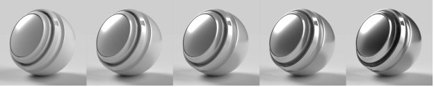
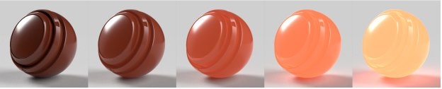
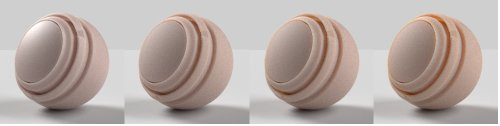
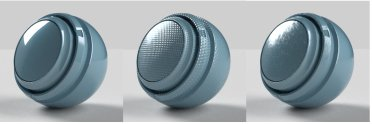

# Adobe 標準教材

>[!NOTE]
>
> Substance 3D Sampler 現在預設使用 [OpenPBR](openpbr.md) 材質模型，而非 Adobe 標準材質。

## 標準材料性質

## 基底表面性質

**底色**

表面的顏色。

**粗糙度**

表面平滑還是霧面。

**金屬**

表面的金屬光澤程度。

**不透明度**

地表的能見度。

**環境遮蔽**

空洞和摺痕造成的陰影阻擋光線照射到表面。

**鏡面層級**

光線反射在表面的強度。

**鏡面邊緣顏色**

光線反射的顏色。 影響金屬材料的斜視角度。

**正常**

模擬表面細節，如凸起和裂縫。

**標準尺度**

正常效應的強度。

**結合法線與高度**

將法線貼圖套用在高度貼圖之上。

**高度**

利用凹凸或幾何位移來製作表面細節。

**身高比例**

高度比例尺以場景單位表示。 這適用於凸起和排氣量。

**高度**

高度貼圖的值代表零位移。

**各向異性能級**

反射的量沿著表面向一個方向延伸。

**各向異性角**

各向異性效應的逆時針旋轉。

**發射強度**

從表面發出的光強度。

**發射色**

發出的光的顏色。

**光澤不透明度**

模擬微小纖維或絨毛對表面的影響。

**光澤色**

光澤效果的顏色。

**光澤粗糙度**

光澤效果的柔和感。

## 內部特性

**半透明**

能透過表面傳遞的光量。

**吸收色**

當色光被吸收時會收斂。

**吸收距離**

以場景單位表示光線在達到吸收色前會移動的近似距離。 若設為零，厚度不會影響吸收顏色。

**折射率**

光線通過物體時彎曲的程度。

**擴散**

折射時色譜的擴散程度。

**次表面散射**

光線會散射到表面以下，而不是直接穿透。

**散射色彩**

表面下的顏色會變成散射光的顏色。

**散射距離**

光必須在達到完全散射前，傳播的距離約為此。

**散射距離尺度**

散射距離的乘數。 每個色道可能都不一樣。

**紅移**

設定紅光比其他光色更遠。 對皮膚很有用。

**瑞利散射**

讓橘色光線深入水面以下，藍光則讓光線更短。

**體積厚度**

相對於物體包圍盒的表面厚度。 用於內部效果，當真實厚度未知時。

**體積厚度尺度**

體積厚度的乘數。

## 被毛特性

**毛皮不透明度**

模擬材料上方的一層。 用於製作透明塗層、清漆和清漆。

**毛色**

毛皮的顏色。

**毛髮粗糙度**

塗層表面有多光滑或霧面。

**被殼折射率**

光線穿過毛皮時會彎曲。

**被殼鏡面水平**

光線在毛皮上反射的強度，角度閃爍。

**毛色正常**

模擬表面細節，例如塗層表面的凹凸和裂縫。

**毛皮正常鱗片**

毛皮強度的正常效應。
