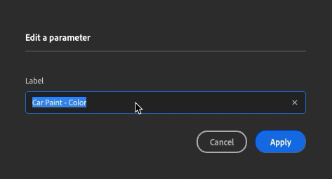

# 匯出參數化資產

暴露的參數可以在其他應用中修改，而不必回到取樣器。 這能縮短迭代時間，讓你能專注於尋找最佳外觀，而不必在不同應用程式間來回切換。

## 曝光與解除參數

要揭露參數，請打開 **屬性面板**。 將滑鼠移或右鍵點擊想要的參數，然後點選針腳圖示或「曝光此參數」。

有兩種方法可以解除參數曝光：

* 在 **「曝光」參數面板**&#x200B;中，右鍵點擊參數並選擇「解除曝光」。

  
* 在 **屬性面板** 中點選交叉針圖示，或右鍵參數選擇「解除曝光此參數」。

  

以下濾波器的參數無法被曝光：

* 圖片到素材（AI 驅動）
* 內容感知填充
* 法線至高度
* 高級化

如果你在包含暴露參數的圖層上方加裝過濾器，匯出時這些參數不會被曝光。\
為避免這種情況，請移除濾波器或放置於不會影響有裸露參數的圖層的位置。

如果你有來自混合的暴露參數，當你把 de layer 移到堆疊底部時，這些參數就會遺失。

## 編輯你的參數

在「暴露參數」面板&#x200B;**右鍵點擊**&#x200B;參數標籤，輸入新名稱，然後點選「套用」。

你可以像&#x200B;**在屬性面板**&#x200B;裡一樣，在「暴露的參數面板&#x200B;**&#x200B;**」中使用這個參數。

## 匯出你的素材

要匯出帶有你暴露參數的素材

1. 打開 <b>匯出面板。</b>
1. 點選匯出。
1. 選擇SBSAR或SBS。
1. 點選「匯出」。

你現在可以在任何支援 SBSAR 檔案格式的軟體中使用帶有暴露參數的素材。
