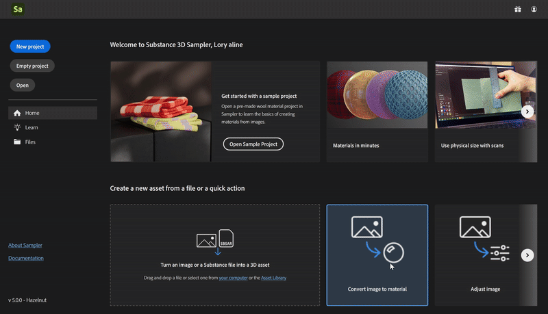

# 快速動作

Quick Actions 是一個系統，讓你能在幾次點擊內建立資產或在堆疊中添加多層。 使用 Quick Actions 來建立資產、建立專案，或將你需要的圖層加入現有的堆疊。

你可以在 Sampler 的多個地方找到快速動作：

* [主畫面](../interface/the-home-screen.md)
* [建立新視窗](../getting-started/project-management.md)
* [快速動作面板](../interface/panels/quick-actions-panel.md)

| 快速行動名稱 | 說明 | 層次 |
| --- | --- | --- |
| 將影像轉換為素材 | 從一張圖片製作包含所有必要通道的素材。 | 輸入影像到材質 AI 等化 |
| 將多角度影像轉換為素材 | 透過合併從不同光角度拍攝的表面照片來創造材質 | 輸入 多角度對材質 均衡 |
| 匯入材質 | 從貼圖中建立材質。 | 輸入 |
| 匯入圖片 | 建立一個空白材質，然後將單一圖片作為圖層加入。 | 輸入 |
| 將圖像轉換為刺繡 | 套用程序濾鏡讓影像看起來像刺繡補丁。 | 輸入刺繡 |
| 製作布料材質 | 製作帶有程序濾鏡的布料材質。 | 布織 |
| 調整影像 | 選擇濾鏡來微調，準備用於材質的影像。 | 輸入裁切平鋪亮度/對立色調/飽和度顏色替換 |
| 創造空白素材 | 創作一個沒有通道的素材。 | 無 |

## 如何使用快速動作

<b>從主畫面</b>

點擊快速動作

或者在快速動作中拖放圖片。

或者在快速動作中拖放圖片。

<b>摘自 Create 新</b>

選擇任何快速動作或匯入檔案，看看哪些快速動作可以用在你的輸入上

<b>來自快速行動小組</b>

點擊快速動作可將其加入堆疊或根據快速動作類型建立新資產：

* <b>應用：</b> 對正在進行的層疊施加快速動作。
* <b>設定：</b> 開啟設定視窗，預先安排快速動作，然後再加入堆疊。
* <b>建立新資產：</b> 從選取的快速動作建立一個新資產。
* <b>建立新專案： </b>從選取的快速動作建立一個新專案。
