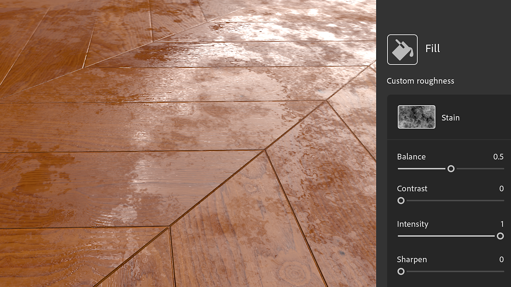

# 材質產生器

材質產生器透過參數化噪音、圖案</b>和<b>垃圾</b>搖滾選項，提供更好的材質製作<b>控制。生成的影像可用於遮罩或通道地圖。

<table>
<tr style="border: 0;">
<td style="border: 0;" valign="top">

</td>
<td style="border: 0;" valign="top">

材質產生器是 Substance 3D Sampler 中的一種資產。 它們可以在資產面板裡用貼圖產生器圖示篩選。

</td>
</tr>
</table>

## 如何使用材質產生器

### 航道地圖

在 3D 視圖、2D 視圖或圖層堆疊中拖放貼圖產生器，並選擇使用通道。

在堆疊中會建立一個填充濾鏡，並將貼圖產生器放在正確的輸入中。 你可以在屬性面板中存取材質產生器的屬性。

#### 濾鏡

有些濾鏡像 Parquet</b> 預設會用貼圖產生器來做圖案遮罩。其他濾鏡<b>則是搭配圖片或像圖案</b>濾鏡這類貼圖產生器<b>來運作。\
在濾鏡中，你可以在任何影像屬性中使用貼圖產生器，例如 <b>自訂遮罩</b>。

篩選器可以建議產生器，這些產生器會在新的資產選擇器中顯示，當你點擊圖片屬性時。

#### 教學

你可以在我們的 [學習頁面](https://creativecloud.adobe.com/cc/learn/app/substance-3d-sampler)找到 Substance 3D Sampler 的所有教學。

[使用 Sampler 的紋理產生器進行紡織設計](https://creativecloud.adobe.com/cc/learn/substance-3d-sampler/web/fabric-texture-generator?locale=en)

[碳纖維材料在數分鐘內使用Substance 3D取樣器](https://creativecloud.adobe.com/cc/learn/substance-3d-sampler/web/create-carbon-fiber-material?locale=en)

[格紋布料材料：幾分鐘內，Substance 3D 取樣器](https://creativecloud.adobe.com/cc/learn/substance-3d-sampler/web/create-plaid-fabric-material?locale=en)

## 如何建立自訂材質產生器

你可以透過 *圖層堆疊動作中的匯入* 按鈕，匯入用 Adobe Substance 3D Designer 製作的貼圖產生器。 它們必須在 Designer 中以特定方式建置，才能在匯入 Sampler 時正常運作。

### 類型

選擇「紋理產生器」作為圖形<b> 類型</b>。

#### 輸出

濾波器的輸出節點必須定義<b></b>識別碼或<b>使用</b>方式：

* 材質產生器的主要輸出不應該有任何使用。 接著，3D 取樣器就能辨識為主要輸出。

<table>
<tr style="border: 0;">
<td style="border: 0;" valign="top">

</td>
<td style="border: 0;" valign="top">

</td>
</tr>
</table>

* <b>材質產生器的次要輸出</b>需要<b>使用</b>。\
  群組名稱會是主要輸出 <b>識別碼</b>。

>[!NOTE]
>
> 如果你自己建置濾鏡與材質產生器來協同運作，我們建議根據輸出識別</b>碼使用<b>自訂使用</b><b>方式。

<table>
<tr style="border: 0;">
<td style="border: 0;" valign="top">

</td>
<td style="border: 0;" valign="top">

</td>
</tr>
</table>

>[!IMPORTANT]
>
> 如果你想讓你的自訂材質產生器出現在「建議資產」篩選器清單中，你需要在 Substance 圖表中加入以下使用者資料：
> 
> 煉金術士：：建議濾器=[FilterName，FilterName2];

>[!NOTE]
>
> 使用者資料可搭配 [自訂篩選](../filters/custom-filters.md)器使用。

#### 格式

將你的過濾器匯出為 Substance Archive 檔案（.sbsar）

>[!NOTE]
>
> 你可以在 Sampler 裡直接暴露濾波器參數來控制濾波器。 點此查看操作指南[&#128279;](https://experienceleague.adobe.com/en/docs/substance-3d-designer/using/substance-graphs/manage-parameters/exposing-a-parameter)
