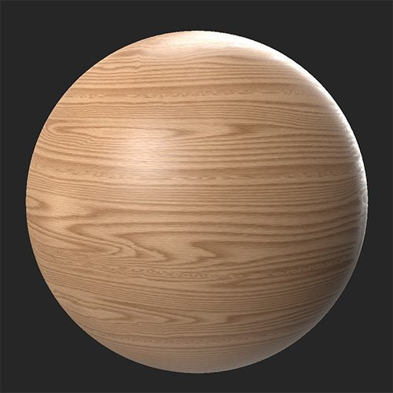

# 上色

<table>
<tr style="border: 0;">
<td width="41.60%" style="border: 0;" valign="top">

**收錄於：** 調整

</td>
<td width="58.30%" style="border: 0;" valign="top">

## 說明

上色功能讓你在不損失細節的情況下，為多個頻道添加色彩。

>[!NOTE]
>
> 雖然 Colorize 濾鏡可以讓你修改法線通道，但除非你對法線通道的運作方式以及對材質的影響有很好的了解，否則這樣做並不是好主意。 這是一個進階功能，通常只在特定情況下使用。

在這些圖片 **中，使用Colorize濾鏡** 調整基色，產生更豐富的木材材質。

<table>
<tr style="border: 0;">
<td style="border: 0;" valign="top">

{width="200px"}

</td>
<td style="border: 0;" valign="top">

{width="200px"}

</td>
</tr>
</table>

</td>
</tr>
</table>

## 參數

**基本參數**

本節可用的參數會根據 **頻道選擇**&#x200B;而改變。

* **頻道選擇**：\
  選擇濾波器會影響的頻道。 建議在 2D 視圖中查看所選通道，直接查看濾波器的效果。
  * ***基礎色彩/發射選項***
    * ***頻道名稱*** **- 顏色**：色彩選擇\
      選擇用來上色通道的顏色
    * ***頻道名稱*** **- 保持亮度**：切換\
      啟用後，原始顏色的明度或亮度值將被保留
    * ***頻道名稱*** **- 強度**：0-1\
      調整 Colorize 效果的強度。
  * ***一般頻道選項***
    * **法線 - 斜角**：0-90\
      修改法線的梯度
    * **普通 - 方向**：0-360\
      調整法線面的方向
    * **普通 - 保持亮度**：切換\
      啟用後，原始法線的亮度將被維持
    * **正常 - 強度**：0-1\
      調整 Colorize 效果的強度。
* **自訂遮罩**：切換\
  啟用或停用自訂遮罩的使用。 啟用後會出現以下參數：
  * **遮罩**：影像/筆刷\
    選擇一張圖片作為遮罩，或用畫筆直接在 2D 視圖中繪製自訂遮罩
  * **自訂面具 - 模糊**：0-1\
    模糊面具
  * **自訂遮罩 - 反轉**：切換\
    反轉遮罩
