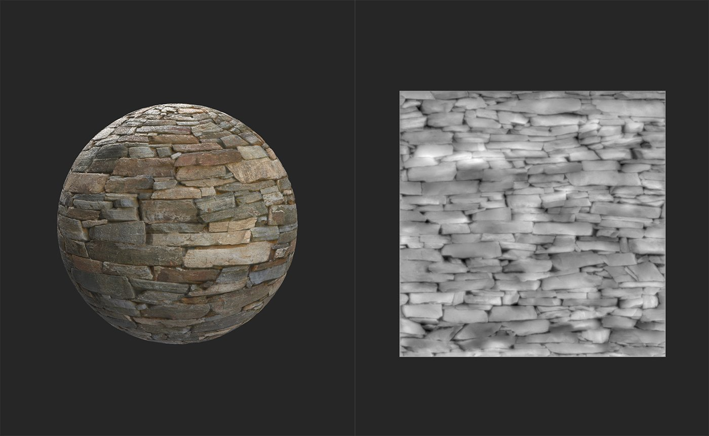

# 均衡

<table>
<tr style="border: 0;">
<td width="41.60%" style="border: 0;" valign="top">

**收錄於：** 調整

</td>
<td width="58.30%" style="border: 0;" valign="top">

## 說明

Equalize 濾波器會根據距離範圍調整局部對比度。 均衡濾波器的目標是減少每個聲道中的巨大差異。 因此，它通常作為 Image to Material（B2M）工作流程的一部分很有用——Image to Material（AI 驅動）濾波器內包含 Equalize 通道以提升效果。

下方圖片展示了 **均衡濾波器的** 運作。

在加入均衡濾鏡&#x200B;**之前**，該材質的高度圖與基底顏色存在顯著差異。

加入均衡濾鏡&#x200B;**後**，高度圖和基底色彩通道會更均勻且不會損失細節。

</td>
</tr>
</table>

## 均衡濾波器教學

## 參數

<b>基本參數</b>

* <b>輸入平鋪</b>：切換\
  啟用時，請將材質視為反覆鋪磚，因此邊界附近的變化會受到對面邊界顏色值的影響。
* <b>半徑</b>：0-1\
  將均衡效應擴散到更廣泛的區域。
* <b>顏色滲出</b>：0-1\
  控制哪些顏色滲透到周圍區域。
* <b>本地比分：</b>0-1\
  調整 Equalize 濾波器如何嘗試保留局部細節。

<b>*頻道*</b>

每個頻道的控制方式相同。

* <b>覆蓋常用參數</b>：切換\
  啟用此功能以自訂此通道的均衡效應。 啟用後，會出現額外的控制功能：
  * <b>輸入平鋪</b>：切換\
    啟用時，請將材質視為反覆鋪磚，因此邊界附近的變化會受到對面邊界顏色值的影響。
  * <b>半徑</b>：0-1\
    將均衡效應擴散到更廣泛的區域。
  * <b>保留本地差異</b>：切換\
    使均衡效應在更高解析度下運作以維持細節
* <b>目標模式</b>：\
  選擇如何偏壓均衡效應。 預設情況下，Equalize 會嘗試將顏色移動到通道的平均顏色方向。 使用參數來偏向選擇的顏色或數值。 選擇參數後，會出現一個額外的控制項：
  * <b>目標</b>：顏色選擇\
    選擇一個顏色或數值作為均衡演算法的目標。
* <b>自訂色彩變化</b>：HSL 滑桿\
  在執行指定通道的均衡演算法後，調整結果的色相、色度（飽和度）和亮度（亮度）。

<b>面具</b>

* <b>自訂遮罩</b>：切換\
  啟用或停用此過濾器的自訂遮罩
* <b>自訂遮罩</b>：影像/筆刷\
  選擇一張圖片作為遮罩，或用畫筆直接在 2D 視圖中繪製自訂遮罩
* <b>自訂遮罩反轉</b>：切換
