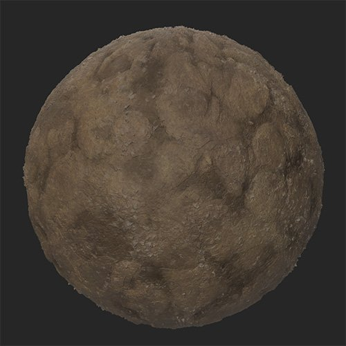

# 碎石路

<table>
<tr style="border: 0;">
<td width="41.60%" style="border: 0;" valign="top">

**收錄於：** 《發電機》

</td>
<td width="58.30%" style="border: 0;" valign="top">

## 說明

碎石過濾器會自然地在材料上層疊加碎石，填滿裂縫。

這些影像顯示 **礫石過濾器** 被用來填補泥土裂縫。

<table>
<tr style="border: 0;">
<td style="border: 0;" valign="top">

</td>
<td style="border: 0;" valign="top">

</td>
</tr>
</table>

</td>
</tr>
</table>

## 參數

**基本參數**

* **隨機種子**：\
  隨機種子決定了使用此濾波器中使用隨機性的其他參數的隨機值。
* **數量**：0-1\
  改變碎石的分布量。
* **原色**：色彩選擇\
  選擇碎石的底色
* **次要色**：色彩選擇\
  選擇碎石的次要顏色
* **底料顏色比賽**：0-1\
  調整碎石顏色受底層材料顏色影響的程度
* **啟用腔體遮罩**：切換\
  啟用後，碎石會填滿空腔，不會分散到材料較高的部分。 這能讓碎石的散落更真實。
* **散射體積閾值**：0-50\
  根據高度值調整散射體積
* **隨機遮蔽**：0-1\
  設定隨機遮蔽的碎石百分比
* **石頭大小**：1-10\
  控制石頭的大小
* **石頭大小變化**：0-1\
  控制寶石大小的隨機性
* **Stone Roundness**：0-1\
  讓石頭變得更圓或更銳利
* **斯通粗糙隊**：0-1\
  調整寶石的粗糙度值
* **斯通高地**：0-1\
  調整石頭的高度。 這會影響寶石與底層材料的融合。
* **石頭高程**：0-1 修改石頭的基底高程。 海拔決定石頭所在的地面，而高度決定石頭離地面的高度。
* **石頭升高隨機**：0-1\
  在每塊石頭的高度上加上一個隨機數值。
* **表面平滑度**：0-1\
  磨平石頭頂端
* **使用自訂遮罩**：切換\
  啟用或停用自訂遮罩來繪製石頭位置。 以下參數只有在啟用「使用自訂遮罩&#x200B;**」時才會顯示**。
  * **面具模糊**：0-1\
    模糊塗裝面具的邊緣
  * **自訂遮罩**：影像/筆刷\
    點擊畫筆可以繪製一個自訂遮罩，讓寶石會出現。 點擊方格可以匯入一張圖片，作為遮罩使用。

**進階參數**

* **表面積（公分）：** 0-1000\
  修改材質所代表的表面尺寸。 增加表面積意味著礫石的物理尺寸變大，並會相應地進行調整。
* **高度深度**&#x200B;**（公分）：** 0-100\
  修改材質高度圖所代表的物理深度。 高度深度增加意味著石頭的物理尺寸比原本更高，因此石頭的正常強度也會增加。
