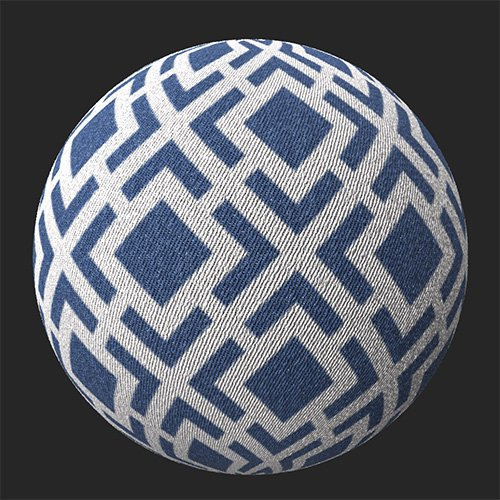

# 圖樣

<table>
<tr style="border: 0;">
<td width="41.60%" style="border: 0;" valign="top">

**收錄於：** 《發電機》

</td>
<td width="58.30%" style="border: 0;" valign="top">

## 說明

你可以從可用選項中加入圖案，或使用圖片或畫筆自訂自己的圖案。

*Pattern濾鏡&#x200B;**應用於牛仔布的範例**。*

<table>
<tr style="border: 0;">
<td style="border: 0;" valign="top">

{width="200px"}

</td>
<td style="border: 0;" valign="top">

{width="200px"}

</td>
</tr>
</table>

</td>
</tr>
</table>

## 參數

<b>基本參數</b>

* <b>隨機種子</b>：0-1\
  隨機種子決定了使用此濾波器中使用隨機性的其他參數的隨機值。
* <b>圖案 </b>：影像選擇器和/或繪畫\
  在材質產生器中選擇圖案或匯入一個
* <b>色彩模式選擇 </b>：材質或僅色彩\
  <b>材質</b> 模式影響所有 *PBR 通道* ， <b>而純</b> 色模式僅 *影響材質的 BaseColor* 。
* <b>顏色量 </b>：1-10\
  從圖樣中選擇活躍顏色的數量
* <b>Hue</b>：0勝1負\
  調整圖案的色調
* <b>面罩顏色</b> ：切換\
  遮罩所選顏色，取決於 <b>色彩量</b>
* <b>替換顏色： </b>切換\
  更換所選顏色，取決於顏色量<b></b>
* <b>粗糙度</b>：0-1\
  設定所選顏色的粗糙度，取決於 <b>色彩量</b>
* <b>金屬：</b>0-1\
  設定所選顏色的粗糙度，取決於 <b>色彩量</b>
* <b>壓印模式</b>：切換\
  選擇所選顏色壓印的方向，取決於<b> 顏色量</b>
* <b>壓印強度： </b>0-1<b>\
  </b>調整所選顏色壓印的強度，取決於顏色量<b></b>
* <b>壓紋距離： </b>0-1\
  拉伸並平滑所選顏色的壓紋區域，視顏色量而定<b></b>
* <b>浮雕紋理： </b>0-1\
  在選擇的顏色中加入顆粒，取決於顏色量<b></b>
