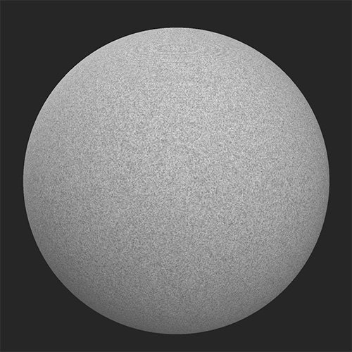

# 拼布縫

<table>
<tr style="border: 0;">
<td width="41.60%" style="border: 0;" valign="top">

**收錄於：** 《發電機》

</td>
<td width="58.30%" style="border: 0;" valign="top">

## 說明

用這個濾網在材料中模擬縫製的拼布圖案。

*在塗抹&#x200B;**被子縫製濾鏡**&#x200B;前後。*

<table>
<tr style="border: 0;">
<td style="border: 0;" valign="top">

{width="200px"}

</td>
<td style="border: 0;" valign="top">

{width="200px"}

</td>
</tr>
</table>

</td>
</tr>
</table>

## 參數

**基本參數**

* **隨機種子**：\
  隨機種子決定了使用此濾波器中使用隨機性的其他參數的隨機值。
* **圖案選擇**：\
  選擇繡法/拼布的圖案風格
* **金額**：1-5\
  控制圖案的鋪磚量
* **輪替：**\
  旋轉圖案
* **頂縫**：切換\
  啟用可新增頂縫並查看相關參數區塊
* **縫線**：切換\
  啟用新增接縫並查看相關參數區段
* **拼布：**&#x200B;切換\
  啟用新增拼布並查看相關參數區塊
* **邊緣塗料**：切換\
  請允許在被子縫合部分之間找到邊緣，並查看相關參數部分
* **進階**：切換\
  啟用查看 **進階** 參數

**頂縫**

* **頂縫顏色**：顏色選擇\
  設定頂縫所用線的顏色
* **頂縫偏移**&#x200B;量：0-1\
  將頂針與縫布區域邊緣的縫線對移
* **頂縫旋轉**：0-1\
  改變構成頂針的針目方向
* **頂針刻度**：0-1\
  調整每個尺寸的頂縫尺寸——寬度、長度和高度
* **刺穿強度**：0-1\
  調整被子縫合上因頂縫造成的凹陷
* **頂縫粗糙度**：0-1\
  調整線的粗糙度
* **頂縫金屬**：0-1\
  調整線的金屬值

**煤層**

* **縫線**&#x200B;**選擇**：\
  選擇要使用的縫線款式
* **縫線強度**：0-1\
  調整接縫的法線強度與高度強度
* **拉伸強度**：0-1\
  調整布料彈性對縫線的影響程度。 這種效果相當微妙。

**拼布**

* **被子類型**：\
  選擇要使用的拼布風格
* **拼布強度**：\
  調整拼布效果的法線強度和高度強度

**邊緣塗料**

* **邊緣選擇**：\
  選擇疼痛是否覆蓋底層材質的法線與高度細節
* **邊緣顏色**：色彩選擇\
  選擇油漆顏色
* **邊緣粗糙度**：0-1
* **Edge 金屬隊**：0-1

**進階**

* **基礎材料高度**：0-1\
  調整底層材質的高度圖強度
* **正常強度**：0-1\
  調整因 Quilt Stitch **濾鏡而改變**&#x200B;法線貼圖強度的幅度。這不會影響底層材料的法線。
