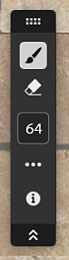

# 複製印章

<table>
<tr style="border: 0;">
<td width="41.60%" style="border: 0;" valign="top">

**收錄於：** 工具

</td>
<td width="58.30%" style="border: 0;" valign="top">

## 說明

**Clone Stamp 工具**&#x200B;幫助你手動複製或修補材料的部分。這對修正接縫或修正材料錯誤很有幫助。 **Clone Stamp 濾鏡** 是左側邊欄可用的工具之一。

下方圖片顯示 **克隆印章** 被用來清除雪中殘骸的過程。

上圖中，雪中散落著許多樹枝和其他雜物。

**複製印章**&#x200B;工具用來移除一些樹枝，並換成乾淨的雪。

</td>
</tr>
</table>

## 複製印章教學

## 參數

<b>基本參數</b>

* <b>展開遮罩</b>：0-1\
  調整濾鏡在塗漆區域周圍的距離，以配合底層材料。
* <b>漸入淡出混合</b>：0-1\
  軟化複製區域的邊緣，幫助與底層材料融合。
* <b>模糊面罩</b>：0-1\
  調整複製印章邊緣的細節量。 提高這個值會讓複製區域的邊緣看起來更像塊狀。
* <b>保持比例</b>：切換\
  關閉後，可以調整蓋印區域的比例。
  * <b>橫向</b>：0-2
  * <b>垂直：</b>0-2
* <b>旋轉</b>：-180 到 180\
  旋轉蓋章區域。
* <b>水平翻轉</b>：切換\
  將壓印區域沿水平軸鏡像。
* <b>垂直翻轉</b>：切換\
  沿著垂直軸鏡像蓋印區域。

<b>淡出混合</b>

使用淡入淡（Fade blending）控制，針對素材中每個聲道分別調整淡入淡入淡的混合。

<b>進階</b>

* <b>正常強度</b>：0-2\
  調整壓印區域內法線強度。
* <b>資料來源立場</b>：\
  0-1：調整水平光源位置。\
  0-1：調整垂直源的位置。
* <b>目標位置</b>：\
  0-1：調整水平目標位置。\
  0-1：調整垂直目標位置。
* <b>平鋪模式</b>：下拉選單\
  啟用或關閉平鋪。

## 使用指南

點擊 **複製印章工具** ，在圖層堆疊頂端建立新的複製印章過濾圖層。 你也可以在圖層面板&#x200B;**裡使用**「新增圖層」按鈕&#x200B;****，新增克隆印章過濾器。

建立克隆印章濾波圖層會&#x200B;**自動在視窗**&#x200B;中開啟 2D 視圖&#x200B;****。當選取複製印章圖層時，2D 視圖頂端會出現一個&#x200B;**工具列**。****

{width="300px"}

要開始使用 Clone Stamp 工具，請點擊並拖曳到 2D 視圖&#x200B;**中**&#x200B;有問題的區域。資料會根據來源自動更新。 使用 **複製印章工具** 的區域會被標示出來。

## 工具列

<table>
<tr style="border: 0;">
<td width="16.67%" style="border: 0;" valign="top">

</td>
<td width="83.33%" style="border: 0;" valign="top">

當選取複製印章圖層時，2D 視圖中會出現一個工具列，並附有額外控制項。

* 選擇筆刷工具</b>加入遮罩，或<b>選擇<b>擦除</b>工具從遮罩中移除。
* 設定目前選取工具的大小。
* 存取額外控制：
  * <b>刷子鋪磚</b>：\
    切換 X 和 Y 刷子平鋪。
  * <b>疊加層：</b>\
    滑鼠移到2D視圖上時，切換是否顯示覆蓋層。
* 查看 2D 視圖控制項。

</td>
</tr>
</table>

>[!NOTE]
>
> 就像其他視窗工具列一樣，你可以拖曳工具列頂端的把手來重新定位工具列，雙擊工具列在視窗內，雙擊把手切換垂直與水平模式，或使用雙倒V形符號隱藏或展開工具列。

## 資料來源選擇

在 2D 檢視中使用 Ctrl + 點擊來新增一個來源。 新增來源會在圖層面板</b>的複製印章圖層<b>下方新增一個印章。你可以分別控制每張郵票。

>[!NOTE]
>
> 通常建議避免將來源點設在你複製區域附近。 如果來源靠近問題區域，就可以複製問題區域。

## 捷徑

| 動作 | Windows + Linux | MacOS |
| --- | --- | --- |
| 增加刷子尺寸 | ] 或 Ctrl + 滑鼠滾輪 | ] 或指令鍵 + 滑鼠滾輪 |
| 減少刷子尺寸 | [ 或 Ctrl + 滑鼠滾輪 | [ 或 指令鍵 + 滑鼠滾輪 |
| 設定源頭 | Ctrl + 左鍵 | Cmd + 左鍵點擊 |
