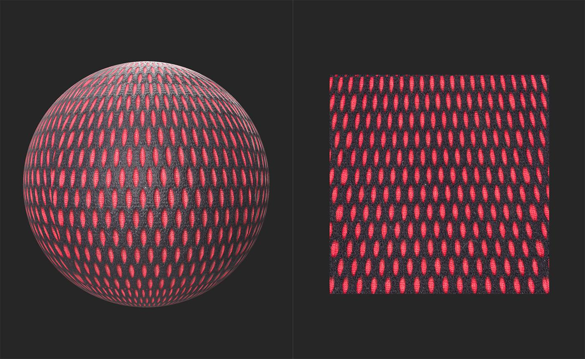
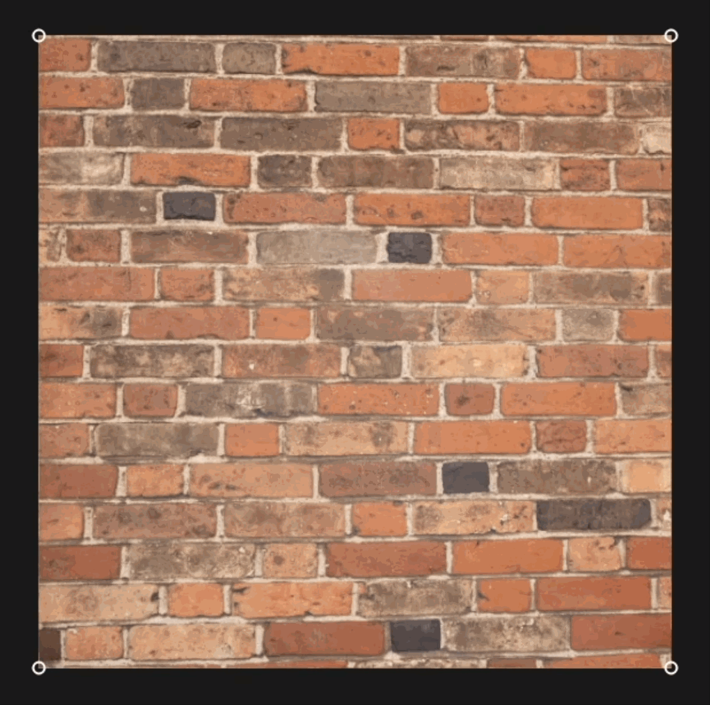

# 透視轉換

<table>
<tr style="border: 0;">
<td width="41.60%" style="border: 0;" valign="top">

**收錄於：** 工具

</td>
<td width="58.30%" style="border: 0;" valign="top">

## 說明

使用 <b>透視轉換工具 </b>來修正圖片中的透視問題。 <b>透視轉換</b> 也可以用於材質。

下圖展示了一個範例材質，在被 <b>透視變換工具</b>固定之前。 注意二維視圖頂部附近的形狀垂直拉伸，與二維視圖底部的形狀相比。

透過 <b>透視轉換</b>，形狀保持一致並形成格子。 從這裡開始，使用像 <b>是 Tiling</b> 或 <b>Make it Tile</b> 這類過濾器，將這些素材轉換成可鋪貼材質會很簡單。

</td>
</tr>
</table>

## 使用指南

選擇透視轉換圖層後，2D 視圖中貼圖的每個角落都會出現一個 handle。 在二維空間中分別移動它們以修正透視。

{width="300px"}

## 工具列

選擇 Perspective Transform 圖層後，2D 視圖&#x200B;**頂**&#x200B;會出現一個工具列。使用 **重置位置按鈕** 將透視轉換圖層的 handle 重設為預設位置。
