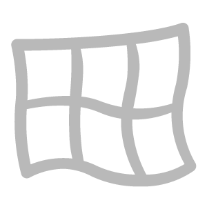

# 曲速

<table>
<tr style="border: 0;">
<td width="41.60%" style="border: 0;" valign="top">

**收錄於：** 工具

</td>
<td width="58.30%" style="border: 0;" valign="top">

## 說明

**Warp 濾鏡**&#x200B;允許你根據產生的多種噪音來扭曲材質。

</td>
</tr>
</table>

## 參數

**基本參數**

* **隨機種子**：\
  隨機種子決定了使用此濾波器中使用隨機性的其他參數的隨機值。
* **噪音選擇**：\
  選擇以哪種聲音作為扭曲的基礎。 不同的聲音會產生不同的效果。
* **噪音等級**：0-10\
  調整來源雜訊的比例。 噪音總是會變。
* **類型**：\
  選擇用哪種方法來扭曲材料。 若 **選擇方向扭曲** 或 **多方向扭曲** ，則會出現額外參數：
  * **曲速角度**：0-1\
    調整變形發生的方向
* **強度**：0-1\
  調整經線強度。
* **自訂噪音**：切換\
  啟用自訂噪音，取代噪音選擇&#x200B;**中的**&#x200B;選擇。可用參數會根據是否 **啟用或停用自訂噪音** 而改變。 啟用後，會出現以下參數：
  * **自訂雜訊模糊**：0-1\
    模糊自訂噪音
  * **自訂雜訊**：影像/筆刷\
    匯入自訂的噪音貼圖作為曲速來源。
* **每通道**&#x200B;曲速：切換\
  啟用後，額外區域會獨立控制每個通道的扭曲。 每個通道可用以下參數：
  * ***頻道名稱***：toggle\
    切換此通道是否受 **Warp 濾波器**&#x200B;影響。
  * **混合模式**：\
    選擇此通道扭曲結果如何與底層圖層混合
  * **不透明度**：0-1\
    更改這個頻道的濾波結果不透明度。
