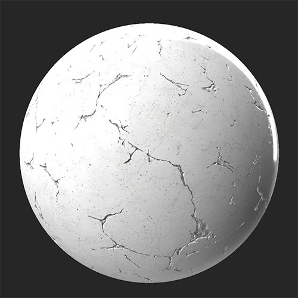

# 裂紋

<table>
<tr style="border: 0;">
<td width="41.60%" style="border: 0;" valign="top">

**內容：** 磨損與表面處理

</td>
<td width="58.30%" style="border: 0;" valign="top">

## 說明

使用 **裂縫過濾器** ，透過在材料上增加裂縫和縫隙網絡，來老化並損害材料。

**裂紋濾鏡**&#x200B;貼在乾淨的大理石材質上。

<table>
<tr style="border: 0;">
<td style="border: 0;" valign="top">

{width="200px"}

</td>
<td style="border: 0;" valign="top">

{width="200px"}

</td>
</tr>
</table>

</td>
</tr>
</table>

## 參數

**基本參數**

* **隨機種子**：\
  隨機種子決定了使用此濾波器中使用隨機性的其他參數的隨機值。
* **裂縫差距**：0-1\
  調整裂縫的擴散距離——這會改變裂縫的寬度和長度。
* **裂縫數量**：0-1\
  改變出現裂縫的數量。

**面具**

* **使用自訂遮罩**：切換\
  啟用或停用自訂遮罩的使用。 啟用後會出現以下參數：
  * **遮罩**：影像/筆刷\
    選擇一張圖片作為遮罩，或用畫筆直接在 2D 視圖中繪製自訂遮罩。
  * **自訂遮罩 - 反轉**：切換\
    把面具倒過來。

**裂縫**

* **裂縫 顏色**：顏色選擇\
  改變裂縫露出的內部表面顏色。
* **Cracks 粗糙度**：0-1\
  調整裂縫的粗糙度值。
* **裂縫 粗糙度 不透明度**：0-1\
  調整裂縫粗糙度&#x200B;**值對粗糙度貼圖的影響程度**
* **金屬裂縫**：0-1\
  調整裂縫的金屬值。
* **裂痕金屬不透明度**：0-1\
  調整裂縫&#x200B;**金屬值對金屬貼圖的影響程度**
* **裂縫高度 強度**：0-1\
  調整裂縫的深度。 這會影響高程圖和濾波器的法線貼圖結果。

**進階參數**

* **正常強度**：0-1\
  調整裂縫法線強度。
* **身高範圍**：0-1\
  調整整件材料的高度範圍。 要調整裂縫高度，請使用 **裂縫>裂縫高度強度**。
* **身高位置**：0-1\
  將整個材質的高度圖偏移。
