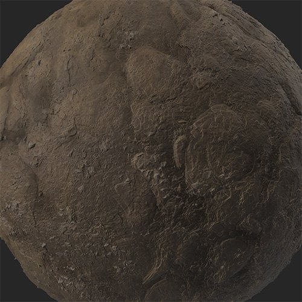

# 苔蘚

<table>
<tr style="border: 0;">
<td width="41.60%" style="border: 0;" valign="top">

**內容：** 磨損與表面處理

</td>
<td width="58.30%" style="border: 0;" valign="top">

## 說明

使用 **苔蘚過濾器** 在材料中添加苔蘚和地衣。 **苔蘚** 利用材料的遮擋圖自然生長在裂縫和縫隙中。

下方圖片顯示了使用苔蘚過濾器&#x200B;**前後**&#x200B;的土壤材料。

<table>
<tr style="border: 0;">
<td style="border: 0;" valign="top">

{width="200px"}

</td>
<td style="border: 0;" valign="top">

{width="200px"}

</td>
</tr>
</table>

</td>
</tr>
</table>

## 參數

**基本參數**

* **隨機種子**：\
  這個隨機種子，而這個過濾器中所有其他隨機參數都是基於它。
* **莫斯全球讓分：** 0-1\
  調整苔蘚在材料上的覆蓋範圍。
* **苔蘚顏色**：顏色選擇\
  選擇苔蘚的原色。
* **次要苔蘚色**：顏色選擇\
  選擇苔蘚的次要顏色。
* **苔蘚重新劃分**：\
  選擇塗抹苔蘚的方法。 預設 **情況下，Occlusion** 會用你材質的 AO 貼圖來套用苔蘚，但其他選項會有不同的效果。 如果&#x200B;**選擇自訂**&#x200B;**遮罩**，**遮罩**&#x200B;**區**&#x200B;塊就會出現。

**面具**

此區塊僅在 **Moss 重新分配**&#x200B;的基本&#x200B;**參數>選擇自訂遮罩**&#x200B;時才會出現。

* **自訂面具 - 模糊**：0-1\
  模糊面具。
* **自訂遮罩 - 反轉**：切換\
  把面具倒過來。
* **自訂遮罩**：影像/筆刷\
  選擇一張圖片作為遮罩，或用畫筆直接在 2D 視圖中繪製自訂遮罩。

**苔蘚**

本節可用參數取決於在 Moss 重新分配&#x200B;**中選擇**&#x200B;的基本參數>選項。

* **遮蔽**
  * **苔蘚阻塞傳播**：0-1\
    根據遮蔽控制苔蘚的擴散。
  * **苔蘚遮蔽面罩**：0-1\
    用遮蔽貼圖當作遮罩來調整苔蘚的數量。
* **整體**
  * **苔蘚整體繁殖**：0-1\
    調整苔蘚的數量。
* **頂端**
  * **頂層莫斯門檻**：0-1\
    控制決定苔蘚是否出現的門檻。
  * **頂部苔蘚角度**&#x200B;根據法線貼圖調整苔蘚與材質的應用方式。
* **全部**
  * **所有**&#x200B;參數都包含了上述&#x200B;**遮蔽**、**整體**&#x200B;**和頂部**&#x200B;等參數。

以下參數可獨立於 Moss 重新分配&#x200B;**的基本參數>選擇**&#x200B;哪個選項。

* **苔蘚花 大小**：0-1\
  改變苔蘚的顆粒度。
* **苔蘚顆粒強度**：0-1\
  調整苔蘚木紋的可見度。
* **苔蘚叢塊大小**：0-1\
  控制苔蘚聚集的傾向。
* **苔蘚叢 銳利度**：0-1\
  調整結塊邊緣的柔軟度。
* **苔蘚叢 強度**：0-1\
  控制苔蘚叢的強度。
* **莫斯·費瑟**：0-1\
  調整苔蘚遮罩邊緣的羽毛狀。
* **Moss Bump 強度**：0-1\
  改變苔蘚的凹凸不平。
* **頂層莫斯門檻**：0-1

**技術參數**

* **正常強度**：0-1\
  調整苔蘚法線的強度。
* **環境遮蔽**&#x200B;強度 控制苔蘚環境遮蔽強度。
