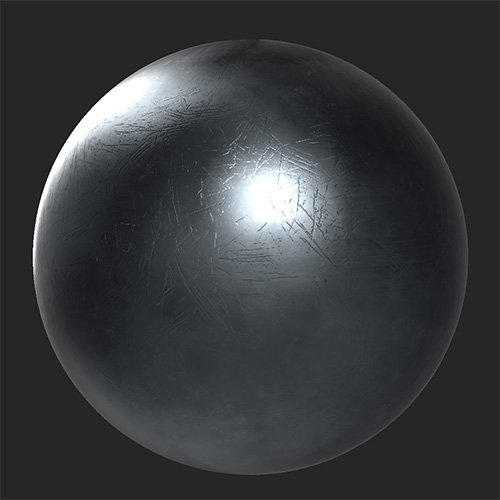

# 刮痕

<table>
<tr style="border: 0;">
<td width="41.60%" style="border: 0;" valign="top">

**內容：** 磨損與表面處理

</td>
<td width="58.30%" style="border: 0;" valign="top">

## 說明

在材料上加上刮痕和磨損。

*塗抹&#x200B;**Scratch 濾網**前後。*

<table>
<tr style="border: 0;">
<td style="border: 0;" valign="top">

{width="200px"}

</td>
<td style="border: 0;" valign="top">

{width="200px"}

</td>
</tr>
</table>

</td>
</tr>
</table>

## 參數

**基本參數**

* **隨機種子**：\
  隨機種子決定了使用此濾波器中使用隨機性的其他參數的隨機值。
* **刮痕**：切換\
  啟用或關閉刮痕。 啟用後 **，Scratch** 區塊會出現。
* **晶片**：切換\
  在表面加上剝落效果。 啟用後&#x200B;****，晶片區塊會出現。
* **微刮**：切換\
  在表面加上細微刮痕。 啟用後 **會出現微刮痕** 區塊。

**刮痕**

**此區段需啟用 Scratch** >基本參數。

* **金額**：0-1\
  控制出現刮痕的數量。
* **強度**：0-1\
  調整刮痕的深度和強度。
* **比例**：1-4\
  改變刮痕的大小。 增加這個滑桿會減少刮痕大小。

**奇普**

**此區段需啟用 Scratch** >基本參數。

* **金額**：0-1\
  控制出現晶片的數量。
* **強度**：0-1\
  調整晶片的深度和強度。
* **比例**：1-4\
  改變晶片的大小。 增加這個滑桿會縮小晶片大小。

**微刮**

* **金額**：0-1\
  控制出現的微刮痕數量。
* **強度**：0-1\
  調整微刮痕的深度和強度。
* **輪值**：0勝1敗\
  旋轉微刮痕。
* **輪替隨機**：0-1\
  隨機調整微刮痕的旋轉角度。
* **比例**：0-2\
  調整微小刮痕的大小。 增加這個滑桿可以增加微刮痕的大小。
* **隨機量表**：0-1\
  隨機調整微刮痕的大小。
* **寬度**：0-1\
  控制刮痕的寬度
* **寬度隨機**：0-1\
  隨機調整微刮痕的寬度。
* **失真**：0-1\
  在刮痕上加入變形以打破均勻性。
* **扭曲隨機**：0-1\
  控制失真效果的隨機性。
* **失真頻率**：0-1\
  控制失真效果的頻率尺度。

**面具**

* **自訂遮罩**：切換\
  啟用或停用自訂遮罩的使用。 啟用後會出現以下參數：
  * **遮罩**：影像/筆刷\
    選擇一張圖片作為遮罩，或用畫筆直接在 2D 視圖中繪製自訂遮罩。
  * **自訂面具 - 模糊**：0-1\
    模糊面具。
  * **自訂遮罩 - 反轉**：切換\
    把面具倒過來。

**進階參數**

* **整體不透明度**：0-1\
  調整 Scratch 濾鏡&#x200B;**效果的**&#x200B;透明度。
* **基色**：切換\
  設定底色通道是否會受到濾鏡的影響。 若啟用，則會出現額外控制：
  * **底色 - 顏色**：顏色選擇\
    選擇刮痕和缺口的底色。
* **金屬：**&#x200B;切換\
  設定金屬通道是否受濾波器影響。 若啟用，則會出現額外控制：
  * **金屬價值**：0-1\
    調整刮痕區域的金屬值。
* **粗糙度**：切換\
  設定粗糙通道是否會受到濾波器的影響。 若啟用，則會出現額外控制：
  * **粗糙度 - 值**：0-1\
    調整刮痕區域的粗糙度值。
* **一般：**&#x200B;切換\
  設定正常頻道是否受濾波器影響。 若啟用，則會出現額外控制：
  * **正常 - 強度**：-1 比 1\
    調整法線強度。
  * **普通 -** **平面化**：\
    將此值降低以使法線趨平。
* **高度**：切換\
  設定高度通道是否受濾波器影響。 若啟用，則會出現額外控制：
  * **身高 - 強度**：0-1\
    調整高度圖的對比度。
* **發射器**：切換\
  設定發射通道是否受濾波器影響。 若啟用，則會出現額外控制：
  * **發射體 - 顏色**：顏色選擇\
    設定發射通道的顏色。
* **鏡面等級**：切換\
  控制鏡面電平通道是否受濾波器影響。 若啟用，則會出現額外控制：
  * **鏡面等級** **- 數值**：0-1\
    調整鏡面通道的數值。
* **環境遮蔽**：切換\
  設定環境遮蔽通道是否會受到濾波器的影響。 啟用後，會出現以下額外控制項：
  * **環境遮蔽 - 強度**：0-1\
    調整生成AO的強度。
  * **環境遮蔽** **- 半徑**：0-1\
    調整AO效果的半徑。
* **不透明度**：切換\
  設定不透明度通道是否會受到濾波器的影響。 若啟用，則會出現額外控制：
  * **不透明度 - 值**：0-1\
    改變材質的不透明度。
