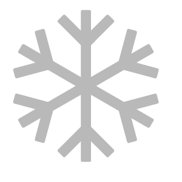

# 下雪

<table>
<tr style="border: 0;">
<td width="41.60%" style="border: 0;" valign="top">

**內容：** 磨損與表面處理

</td>
<td width="58.30%" style="border: 0;" valign="top">

## 說明

用 **雪過濾器** 在材料上加入從薄薄到幾英尺厚的雪。

</td>
</tr>
</table>

## 參數

**基本參數**

* **隨機種子**：\
  隨機種子決定了使用此濾波器中使用隨機性的其他參數的隨機值。
* **新鮮雪**：0-1\
  改變積雪量。
* **融雪隊**：0-1\
  控制融化的雪量。 這個參數非常敏感。
* **進攻**：0-1\
  調整積雪的積雪量。 這會掩蓋底層的高度細節。
* **平滑度**：0-1\
  控制雪面的平滑程度。 這會遮蔽底層高度細節，讓雪看起來更柔軟且更深。
* **弗萊克斯強度**：0-1\
  調整雪花的可見度。
* **使用自訂遮罩**：切換\
  啟用或停用自訂遮罩的使用。 啟用後會出現以下參數：
  * **自訂遮罩**：影像/筆刷\
    選擇一張圖片作為遮罩，或用畫筆直接在 2D 視圖中繪製自訂遮罩。
  * **面具模糊**：0-1\
    模糊面具。
  * **掩體強度**：0-1\
    調整遮罩的不透明度。
