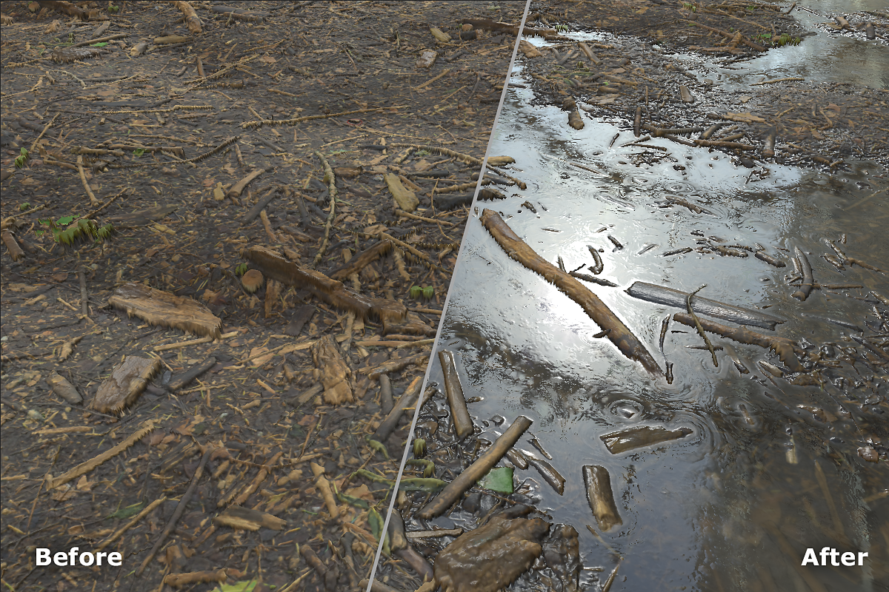

# 水

<table>
<tr style="border: 0;">
<td width="41.60%" style="border: 0;" valign="top">

**內容：** 磨損與表面處理

</td>
<td width="58.30%" style="border: 0;" valign="top">

## 說明

用 **Erode 過濾器** 來磨蝕材料的高處。

</td>
</tr>
</table>

## 參數

**基本參數**

* **隨機種子**：\
  隨機種子決定了使用此濾波器中使用隨機性的其他參數的隨機值。
* **水位**：0-1\
  調整水的高度。
* **水之暗：** 0-1\
  讓水變淺或變暗。
* **埃奇斯濕潤度**：0-1\
  調整材料在水面以上看起來濕潤的程度。
* **啟用水**&#x200B;面泥土：切換\
  稍微修改粗糙度貼圖，在水面上加泥土。 **只有啟用此參數時，Dirt 區塊**&#x200B;才會出現。
* **自訂遮罩**：切換\
  啟用後會出現以下額外控制：
  * **遮罩**：影像/筆刷\
    選擇一張圖片作為自訂遮罩，或用畫筆直接在 **2D 視圖**&#x200B;中繪製遮罩。

**泥土**

此區塊僅在 **啟用基本參數>啟用水** 上泥土時才會顯示

* **泥土數量**：0-1\
  調整水面上漂浮的泥土量。
* **失真強度**：0-1\
  根據水與材料其他部分的交會點，控制表面土壤的變形程度。
* **泥土邊境強度**：0-1\
  管理泥土遮罩邊緣附近表面泥土的強度。
* **泥地邊界距離**：0-1\
  控制土壤邊界與材料濕乾區域交界處的距離。
* **邊境精準**&#x200B;度：0-1\
  調整泥土邊框的精度。
* **邊境曲速**：0-1\
  將邊框變形，以打破泥土表面的均勻性。

**進階參數**

* **Edges 濕度距離**：0-1\
  控制邊緣濕度延伸到乾燥區域的深度。
* **深度模糊量**：0-1\
  調整水下區域底色模糊程度。
* **深度模糊不透明度**：0-1\
  調整水的透明度。
* **污泥顏色**：顏色選擇\
  改變水面上泥土的顏色。
* **污泥不透明度**：0-1\
  調整污泥的透明度。
