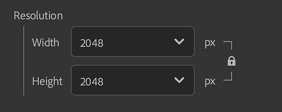

# 匯出視窗

你可以從<b>右側欄</b>的匯出</b>面板<b>匯出你的資產。

匯出選項取決於所匯出的資產類型。

物料出口的匯出視窗。

>[!NOTE]
>
> 匯出面板也有將資產送給 Substance 3D 設計師、畫家或 Stager 的選項。 這樣會自動匯出你的資產，並設定正確的設定，適用於其他 Substance 3D 應用程式。

## 一般設定

以下設定適用於所有資產類型。

* <b>名稱：</b>此欄位定義你匯出的資產名稱。 它會作為匯出檔案名稱中的前綴使用。
* <b>儲存到：</b>選擇資產的匯出目的地。你也可以選擇在選定的位置建立子資料夾。 如果啟用這個選項，子資料夾會以你的資產命名。

## 材質設定

匯出材料時，匯出視窗的材料設定面板有以下選項：

* <b>格式：為</b>匯出的資產選擇一種檔案格式。
  * <b>SBSAR：</b>匯出您的資料，用於任何支援 Substance 材料的應用程式。
  * <b>SBS</b>：匯出你的素材，這樣就能在 Substance 3D Designer 中開啟。
  * <b>EXR、JPEG、PNG、TARGA、TIFF：</b>將你的素材匯出為一組影像檔案。

>[!NOTE]
>
> Normal 和 Height 通道的位元深度被強制限制為 16 位元。 其他通道則依材質和資產使用的濾波器，以 8/16 位元匯出。 根據檔案格式，位元深度可以調整，因為某些檔案格式不支援高位元深度。

{width="400px"}

* <b>預設 </b>（EXR、JPEG、PNG、TARGA、TIFF）：選擇預設以自動設定特定應用程式或流程的檔案匯出。
  * <b>預設（專案工作流程）</b>選項會顯示你所有可用的素材頻道清單，且未套用任何預設。
  * 使用 <b>預設參數右側的「管理預設</b>」按鈕來編輯預設或新增自己的預設。<b> </b>
  * [更多關於預設的資訊請見此處。](../managing-presets.md)

>[!NOTE]
>
> 如果你的匯出格式是 SBS 或 SBSAR，預設選項就無法選擇。 對於這些格式，輸出檔已設定為可用於所有 Substance 產品及整合。

* <b>材料類型 </b>（SBSAR、SBS）：選擇出口材料的行為方式為標準材質、貼紙或地圖集。 此設定可能會改變其他支援 SBSAR 與 SBS 檔案的應用程式對其處理方式。

* <b>壓縮</b>（SBSAR、SBS）：選擇匯出檔案的壓縮方式
  * <b>自動</b>：允許取樣器決定壓縮設定。
  * <b>最佳：</b>此選項會讓檔案變小，但也可能意味著在編碼或解碼時，載入與儲存時間會更長。
  * <b>無：</b>不使用壓縮時，檔案會變大，但載入和儲存速度會更快。
* <b>解析度（</b>SBSAR、SBS<b>）：</b>選擇材料的輸出解析度。
  * 預設解析度是基於 Sampler 的全域參數。 如果你選擇不同解析度，Sampler 會用這個新解析度重新計算你所有的材質。 這可能會影響你材料的最終外觀。

* <b>解析度 </b>（影像格式）：選擇是將每個圖層的解析度獨立匯出，或覆蓋解析度，使所有圖層以統一大小匯出。 如果選擇全部覆寫，則會出現修改輸出解析度的選項。
  * 預設情況下，解析度是根據每層的輸出解析度來決定。 如果你選擇不同解析度，Sampler 會用這個新解析度重新計算你所有的材質。 這可能會影響你材料的最終外觀。

* **材質模型** （預設設定時所有格式）：為匯出的材質選擇一個著色器標準。
  * 更改材質模型會影響匯出檔案的檔案名稱。 例如，OpenPBR 使用「金屬性」，而 ASM 則使用「金屬」。

### 其他資訊

你選擇的目的地磁碟上的可用磁碟空間會在匯出視窗</b>底部<b>顯示。

>[!NOTE]
>
> <b>實體尺寸</b> 是在材料建立時設定的，匯出時無法修改。

### 管道

在材質設定面板</b>的右側<b>，可以看到可匯出的通道及其解析度清單（預設通道和自訂通道）。

每個預設都有不同的通道要匯出，匯出檔案名稱則是根據「通道輸出</b>」區域中可見<b>的名稱來決定。你可以在任何頻道旁邊的勾選框來啟用或停用該頻道的匯出。

