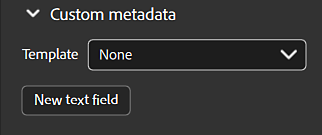

# 元資料面板

{width="500px"}

在元資料面板中，你可以存取並修改資產的元資料。

<b>名稱</b>：資產名稱。

<b>描述</b>：您的資產描述或嵌入於物質材料中的描述

<b>類別</b>：您資產或嵌入於物質中的類別

<b>作者</b>：你資產的作者或嵌入於物質內容中的作者。 預設情況下，作者的名字就是你作業系統帳號的名稱。

<b>建立日期</b>：你在 Sampler 中資產的建立日期或匯入到 Sampler 的日期。 （此內容不可編輯）

<b>更新日期</b>：資產最後更新的日期。 （此內容不可編輯）

<b>標籤</b>：你資產的標籤或嵌入在物質材質中的標籤。

<b>實體尺寸</b>：資產的X、Y、Z大小。

<b>評級</b>：資產評級。

## 自訂元資料

所有自訂的元資料都會包含在材料檔案（SBSAR）中，以確保跨應用程式共享數位資料的工作流程更有效率。

{width="350px"}

<b>新增文字欄位 </b>（新增自訂欄位用於元資料）：

1. 插入名字。 自訂元資料的名稱必須是有效的 XML 元素名稱（例如：無空格或特殊字元，且不以數字開頭......）
1. 插入說明/註解

將滑鼠移到欄位上，選擇出現的編輯或刪除按鈕，即可修改自訂元資料欄位。
