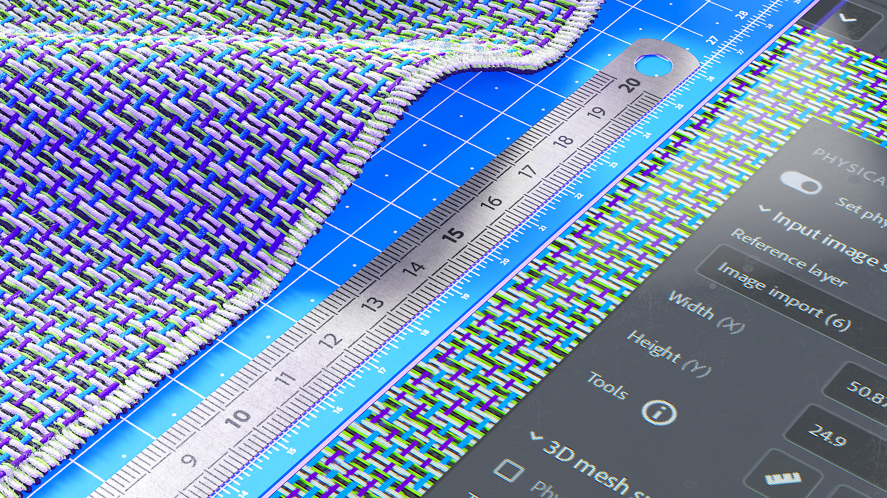

# 實體尺寸面板

<table>
<tr style="border: 0;">
<td width="41.60%" style="border: 0;" valign="top">

</td>
<td width="58.30%" style="border: 0;" valign="top">

使用 **實體尺寸面板** 來設定掃描樣本和影像的實際物理尺寸。

</td>
</tr>
</table>

在數位環境中，將掃描樣本和影像的實際尺寸相匹配，以創造跨應用程式的物理精確視覺效果。\
以下工具與參數能讓你定義材質的物理尺寸，並在物件上套用材質時創造出準確且逼真的視覺效果。

## 設定實體尺寸

>[!NOTE]
>
> 要設定材質的實體大小，你需要有一個圖片匯入圖層。

為了計算你的樣本/影像的物理尺寸，啟用 **設定物理尺寸**。

### 輸入影像尺寸

此區塊允許你手動設定樣本大小，並提供自動計算實體尺寸的工具。

**參考層：** 參考計算物理尺寸的影像。\
**寬度（X）：** 設定參考層的物理寬度\
**Height（y）：** 設定參考層的物理高度\
**工具：**

測量診斷功能可以讓你測量影像上兩點之間的距離（僅供參考用途）。

自動測量工具可以讓你根據影像元資料（dpi）估算樣本的物理尺寸。 此方法僅適用於掃描樣本。

測量工具允許你透過指定樣品兩個特徵之間的物理距離來校正物理尺寸。 這通常是計算樣本物理大小的最佳方法。

### 3D 網格表面

這些工具可以讓你設定材質表面的外觀。

**物理尺度：** 啟用或關閉物理尺度。 物理尺度是網格沿三個軸的周長。\
用物理值來調整你的材料。 操作寬度（X）、高度（Y）和深度（Z）。\
**貼圖平鋪：** 設定材質的平鋪

### 產出資料

幫助你將素材的產出與現實生活層面視覺化。

**顯示與物理比例：**\
2D 視窗中的顯示會遵守物理比例。\
**高度比例：** 根據物理比例從 3D 視窗設定/計算。
