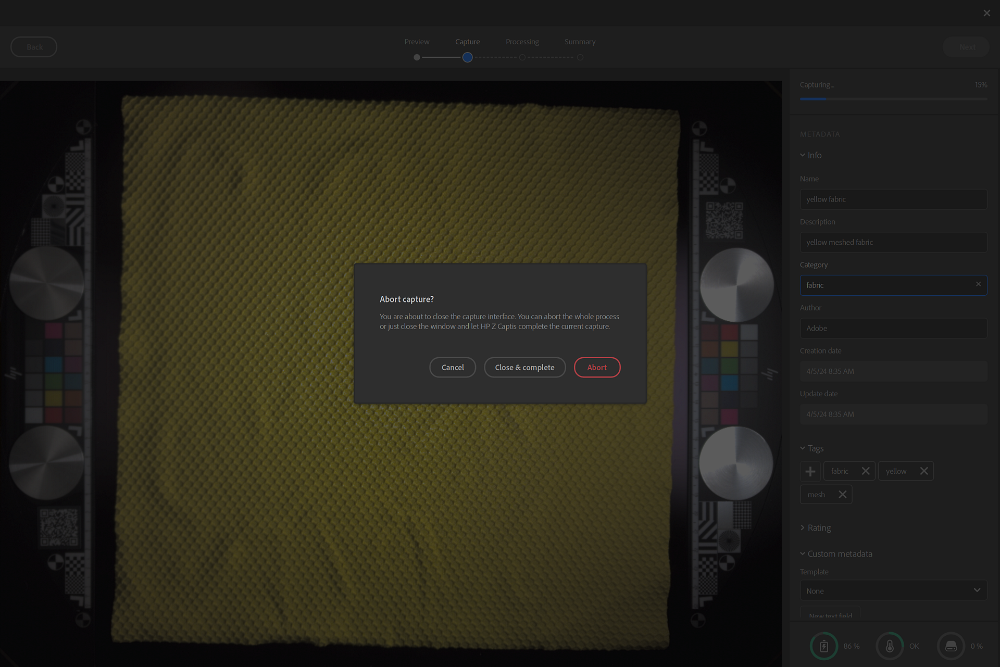

# 啟動 Sampler 並開啟 HP Z Captis

當 Sampler 啟動且確認 HP Z Captis 裝置已插入電腦後，點擊左側列上的 Captis/錐形圖示。

如果您在介面中看不到 HP Z Captis，請參考常見問題集。

點擊 HP Z Captis 後，會跳出一個專門視窗，裡面有三個選項：

1. <b>瀏覽內容</b>：它會開啟檔案總管，瀏覽你 HP Z Captis 裝置的本地儲存空間。
1. <b>開始掃描</b>：它會初始化 HP Z Captis 裝置並開始擷取流程。
1. <b>關機</b>：它會關閉裝置並關閉視窗。

## 關閉 HP Z Captis 視窗

只要你關閉 HP Z Captis 視窗，隨時都會被問到是否要 <b>繼續流程</b> 或 <b>中止</b>。

如果你選擇繼續，裝置會離線執行目前的任務，並在當前步驟結束時暫停。 你可以之後再重新連接 Sampler，繼續進行擷取的下一步驟。

## 預覽步驟

Sampler 將初始化 HP Z Captis 裝置預覽版。 建議 <b>在檢視初始化時不要與它互動 </b>。

這次更新有兩種模式：自動和手動。

### 一般設定

#### 自動模式

你現在可以一鍵啟動擷取：Sampler 將：

* 定義一個預設名稱，
* 利用背光自動定義感興趣區域（ROI）/作物區域，
* 重點放在完整的投資報酬率（ROI）上，
* 把強度設定改成適合你作品的設定。

如果你之前有擷取，選取的材質類別、輸出和擷取解析度都會和你之前的擷取相同。

#### 手動模式

你也可以選擇手動定義部分設定：

*專案名稱*

你可以定義擷取的專案名稱，並定義想要取得哪種類型的輸出。

*輸出*

* 預設情況下，只有材質的 PBR 通道（基底顏色、法線、高度和不透明度）會被保存。\
  你可以選擇輸出類型，選擇低動態範圍（LDR）和高動態範圍（HDR）。

*捕獲解析度*

* 239 px/in - 94 px/cm（預覽：畫質較低，掃描較快）
* px/in - 142 px/cm（預設：高品質，大多數工作流程可輕鬆管理——相當於 30x30cm 拍攝的 4k）
* 718px/in - 284 px/cm（全解析度 - 相當於 30x30cm 拍攝時的 8k）

注意：Sampler 只會載入 PBR 頻道。\
預設的資料夾擷取可在偏好設定中修改。

<b>材料類別</b>

設定為你掃描的材質類型，針對特定素材進行地圖生成。\
預設選擇的類別是「Fabric」。 這有助於優化粗糙通道的結果。

如果您正在掃描的材料包含多種材料，請選擇最大類別。

<b>作物</b>

裁切可以自動或手動完成。

自動裁切會利用背光來定義材質的輪廓，並將感興趣區域（ROI）放在周圍。 當同時數位化多個材料樣本，或材料高度透明時，此方法不適用。
在這種情況下，可以透過在預覽中拖曳裁切元件的角落，或設定定義的解析度或實體尺寸來定義投資報酬率。

<b>相機設定</b>

* 強度：調整相機曝光。\
  點擊自動會使用ROI中心來定義材料的最佳強度。

* 對焦：它會調整相機的對焦。\
  點擊自動即可以完整投資報酬率定義理想焦點。
  這種新的聚焦演算法，不再聚焦於單一點，讓數位化素材能更均勻地聚焦，進而產生更高品質且更容易平鋪的掃描。

如果你喜歡，也可以手動設置兩個。

<b>其他設定</b>

其他類型的設定<b> 則偶爾</b>需要修改：顏色和對齊校正。

* 色彩校正

透過 HP Z Captis 技術區域校準基礎色彩貼圖的顏色。 \
這樣最終材料的顏色會和你加入 HP Z Captis 托盤的樣品完全一樣。\
帶有色片的技術區域會自動被偵測並用於校正。它們必須放置在樣本兩側的特定空間。

這功能僅在工作室模式中提供。 請務必在這次色彩校正前先完成對焦。

這項校正必須每隔幾個月</b>進行<b>一次。不必每次掃描或每次使用都做。

* 校準校正

這個對<b>齊必須在<b>你第一次設定裝置</b>時完成</b>，每次實際移動時，然後每隔幾個月再做一次。<b>並非每次</b>擷取</b>都必須進行此程序<b>。

請務必在校準前先做對焦。

要進行對齊，請 <b>將帶有清晰資訊的物品，例如印有文字的紙張放在捕捉空間</b>中央，關閉抽屜並點擊對齊按鈕。 完成後，你可以確保所有設備就位，技術區域在掃描空間兩側各就各位，中間放置材料，必要時用HP Z Captis裝置附帶的磁鐵固定，然後開始掃描材料。

一切準備就緒後： <b>開始掃描</b>。

## 擷取、處理與複製步驟

掃描開始後，預覽會顯示過程中拍攝的照片。

處理部分分為三個部分：

* <b>拍攝</b>：拍攝所有必要的照片

* <b>處理：</b>處理照片以產生 PBR 通道（基底色、法線、高度、不透明度）

* <b>複製</b>：將結果從 HP Z Captis 裝置複製到您的電腦

在擷取和處理過程中，你可以新增元資料（和你在 Sampler 元資料面板中會找到的元資料一樣）。

在處理過程中，你會看到成果是一格一格地建造的。

## 摘要步驟

此時你可以檢視掃描結果。 所有建立的通道都會顯示（在檔案總管模式下，因為總覽環沒有背光，所以不會產生不透明度）。

你可以選擇把素材送到 Sampler，加入你的專案並開始處理。
你也可以直接開始新的擷取，而不把它加入專案。
在這兩種情況下，你都會在電腦上的相應資料夾中找到掃描地圖：C：\Users\username\Documents\Adobe\Adobe Substance 3D Sampler\Captis\Material

## 資料版本

退出 HP Z Captis 視窗後，通道（基底色、法線、高度、粗糙度和不透明度（如相關）會以圖層形式加入圖層面板。

使用取樣濾鏡（均衡、透視裁切、平鋪等）來處理和清理你的素材。

完成後，你可以：

* 儲存你的取樣器專案：檔案 > 另存為 ...（Ctrl + S）

* 匯出你的素材：檔案 > 匯出...（Ctrl + E）

