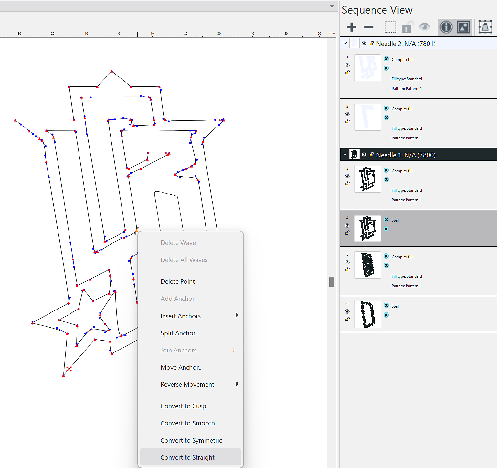

# Tajima 刺繡檔案的匯出器外掛

有了這個首次概念驗證，你現在可以將他們從 Adobe Substance 3D 的數位刺繡設計直接轉移到 <b>Tajima DG17</b> 刺繡軟體中，省去了繁瑣的手動數位化需求。

讓我們一步步來看看怎麼用它。

## 下載

點此下載Sampler Tajima外掛：

[下載外掛點此](https://www.adobe.com/go/sampler-tajima-plugin)

## 安裝

*摘自 Sampler UI：*

到偏好設定>插件與腳本>新增插件

選擇下載資料夾的解壓縮資料夾

*從你的檔案總管拿出：*

前往文件> Adobe > Adobe Substance 3D 取樣器>插件

複製貼上下載檔案的解壓縮資料夾

## 安裝

打開你的 Sampler（5.0.3 或之後版本）專案，裡面有刺繡材料。

打開Tajima插件，匯出到你想要的位置

<b>Tajima 軟體</b>

<b>1</b>- 啟動Substance 3D精靈

<b>2</b>- 選擇適當的 <b>資料資料夾</b> （取樣器匯出資料夾）

<b>3</b>- 選擇刺繡線表

<b>4</b>- 套用風格預設以達到最佳布料設定

<b>5</b>- 根據需要編輯形狀以達到最佳效果

<b>6</b>- 預覽設計工作表，附有機器掃描條碼

