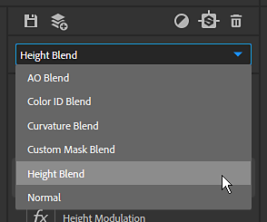

# 版本 2019.1

**Substance Alchemist 2019.1「芝麻」** 讓你透過全新的專案管理分享你的資產。 圖層堆疊已經完全重建，以改善工作流程。 視窗中新增了更多控制與資訊。 我們新款的 Delighter 能提升您材料的品質與準確性。

發行日期： *2019年11月4日*

>[!NOTE]
>
> **注意：** 以 beta 版本 0.8.1 或更早版本製作的內容與 2019.1 版本不相容。 不過這些資料並未遺失，且透過啟動版本 0.8.1 仍可存取。

## 主要特色

### 全新歡迎畫面

《物質煉金術師》現在有一個歡迎畫面，讓你能快速加入最新的專案，也能創造新的作品。 歡迎畫面也提供一些連結，指向我們現有的平台，例如 [Substance Academy](https://academy.substance3d.com/)。

### 專案管理

2019.1 版本引入了專案的概念，可以收集資料集合。 專案也可以匯出，分享到其他電腦。

欲了解更多專案資訊，請參閱： [專案管理](../../getting-started/project-management.md)。

### 新喜悅號

我們改良了 delighter，用來去除照片中的陰影。 現在它保留了各種表面的細節和原始色彩，這將提升生成材質的準確度。

### 新層堆疊

Layer Stack 從零重建，擴展其可能性與行動。 主要變更包括：

* **材質與面具現在可透過專屬圖示直接存取**\
  當將材質加入圖層堆疊時，現在會有一個新的遮罩圖示。 點擊這個第二個圖示會顯示材質的混合參數。

  
* **混合模式可以直接從工具列切換**\
  從現在開始，當選取材質圖層時，可以直接從圖層堆疊工具列更改其混合模式，無需點擊遮罩。

  
* **將位圖指派給特定的掃描輸入**\
  當匯入點陣圖來從掃描建立材質時，你可以為每個位圖指定正確的使用方式。

  

### 觀景窗改善

視窗新增了一些功能，提升了使用效率。 這些新設定可在檢視器設定面板](https://helpx.adobe.com/substance-3d/unlisted/documentation/sadoc/viewer-settings-188973164.html)中存取[。

* **相機模式**\
  相機投影模式允許在透視與正交投影間選擇。

  
* **相機視野**\
  你現在可以更改視窗的相機視野（FOV）。 調整這個數值有助於你真實地視覺化你的材料。 視野只能在透視投影模式下控制。

  
* **解析度與每通道位元深度**\
  2D 視圖現在會顯示每個通道的材質解析度和位元深度。

  

## 發行說明

### 2019.1.4 芝麻

*（2020年1月30日發行）*

**補充：**

* [資源]清除資源資料夾時的確認提示

**修正：**

* [層次]將層移到下方或以上兩層以上
* [創建]分配足夠的 VRAM 預算以維持良好效能

**已知問題：**

* 大量資源匯入會大幅拖慢物質煉金術師的進度
* 內容感知填充濾鏡在高解析度下速度較慢
* 不建議在同一材料中使用多個 Delighters（甜點）
* Delighter 在較舊的 NVIDIA 驅動程式（低於 400.x）時會當機
* 在滑桿中輸入特定evalue時，可以忽略Coma或點
* 在 MacOS 上，法線到高度過濾器可能會當機

### 2019.1.3 芝麻

*（2020年1月28日發行）*

**補充：**

* [工作流程]支援多種工作流程
* [工作流程]支援 PBR 鏡面光澤工作流程
* [工作流程]新頻道設定面板
* [工作流程]專案建立時的工作流程選擇
* [通道設定]啟動/停用特定通道計算
* [頻道設定]顯示目前素材中可用自訂頻道列表
* [頻道設定]必要時自動計算自訂頻道
* [通道設定]自訂通道的強制/阻擋計算
* [圖層]Atlas Scatter 與 Splatter 濾波器中材質輸入佔位符的新使用者介面
* [圖層]影像輸入參數濾波器的底層可由其下層提供
* [圖層]當部分圖層過期時，請顯示通知
* [圖層]可透過通知更新至最新版本的舊圖層
* [專案]專案建立時新增的元資料欄位
* [啟發]生成的變體是針對特定專案的
* [2D 視角]在圖層輸入、圖層輸出和材質輸出之間切換
* [歡迎畫面]新增匯入專案（.alch）選項
* [偏好設定]新增偏好設定視窗，可設定快取位置與分析隱私設定
* [使用者介面]新的使用者介面按鈕
* [效能]平行化系統的整體改進
* [性能]材料數量的優化計算
* [引擎]物質引擎更新
* [框架]升級至Qt 5.13
* [MacOS]macOS Catalina 支援的全球改進
* [內容]調整濾波器-正常強度與反轉參數

**修正：**

* [圖層]刪除圖層時取消影像輸入參數
* [圖層]在新增克隆補丁圖層時，如何修復當機問題
* [圖層]修正一些當圖層混合時的崩潰，將材質堆疊到其他圖層，再堆疊材質
* [匯出]現在尊重頻道選擇以供輸出
* [資源]在資源面板中導航時請勿當機
* [資源]修正匯入損壞 Substance 檔案時的當機
* [資源]在載入大型資料夾時，減少當機次數
* [縮圖]縮圖計算不會凍結介面
* [影像匯入]支援整個應用程式的影像類型統一化
* [預設]從 SBSAR 建立預設時，請儲存描述
* [啟發]修正拖放圖片
* [應用程式]修復在出口處當機
* [應用程式]修復：匯出材料時出口當機
* [使用者介面]修正與改進
* [使用者介面]將暫存資產重新命名為「未儲存素材」
* [內容]全域更新與清潔所有過濾器

**已知問題：**

* 大量資源匯入會大幅拖慢物質煉金術師的進度
* 內容感知填充濾鏡在高解析度下速度較慢
* 不建議在同一材料中使用多個 Delighters（甜點）
* Delighter 在較舊的 NVIDIA 驅動程式（低於 400.x）時會當機
* 在滑桿中輸入特定evalue時，可以忽略Coma或點
* 在 MacOS 上，法線到高度過濾器可能會當機

### 2019.1.2 芝麻

*（2019年12月11日發行）*

**補充：**

* [工作流程]支援多種工作流程
* [工作流程]支援 PBR 鏡面光澤工作流程
* [工作流程]新頻道設定面板
* [工作流程]專案建立時的工作流程選擇
* [通道設定]啟動/停用特定通道計算
* [頻道設定]顯示目前素材中可用自訂頻道列表
* [頻道設定]必要時自動計算自訂頻道
* [通道設定]自訂通道的強制/阻擋計算
* [圖層]Atlas Scatter 與 Splatter 濾波器中材質輸入佔位符的新使用者介面
* [圖層]影像輸入參數濾波器的底層可由其下層提供
* [圖層]當部分圖層過期時，請顯示通知
* [圖層]可透過通知更新至最新版本的舊圖層
* [專案]專案建立時新增的元資料欄位
* [啟發]生成的變體是針對特定專案的
* [2D 視角]在圖層輸入、圖層輸出和材質輸出之間切換
* [歡迎畫面]新增匯入專案（.alch）選項
* [偏好設定]新增偏好設定視窗，可設定快取位置與分析隱私設定
* [使用者介面]新的使用者介面按鈕
* [效能]平行化系統的整體改進
* [性能]材料數量的優化計算
* [引擎]物質引擎更新
* [框架]升級至Qt 5.13
* [MacOS]macOS Catalina 支援的全球改進
* [內容]調整濾波器-正常強度與反轉參數

**修正：**

* [圖層]刪除圖層時取消影像輸入參數
* [圖層]在新增克隆補丁圖層時，如何修復當機問題
* [圖層]修正一些當圖層混合時的崩潰，將材質堆疊到其他圖層，再堆疊材質
* [匯出]現在尊重頻道選擇以供輸出
* [資源]在資源面板中導航時請勿當機
* [資源]修正匯入損壞 Substance 檔案時的當機
* [資源]在載入大型資料夾時，減少當機次數
* [縮圖]縮圖計算不會凍結介面
* [影像匯入]支援整個應用程式的影像類型統一化
* [預設]從 SBSAR 建立預設時，請儲存描述
* [啟發]修正拖放圖片
* [應用程式]修復在出口處當機
* [應用程式]修復：匯出材料時出口當機
* [使用者介面]修正與改進
* [使用者介面]將暫存資產重新命名為「未儲存素材」
* [內容]全域更新與清潔所有過濾器

**已知問題：**

* 大量資源匯入會大幅拖慢物質煉金術師的進度
* 內容感知填充濾鏡在高解析度下速度較慢
* 不建議在同一材料中使用多個 Delighters（甜點）
* Delighter 在較舊的 NVIDIA 驅動程式（低於 400.x）時會當機
* 在滑桿中輸入特定evalue時，可以忽略Coma或點
* 在 MacOS 上，法線到高度過濾器可能會當機

### 2019.1.1 芝麻

*（2019年11月26日發行）*

**補充：**

* [混合]新不透明度混合模式
* [引擎]新物質引擎版本

**修正：**

* [層級]在刪除仍在計算的層級時修復崩潰
* [層次]在移除底層時修復崩潰問題
* [層次]修正當材質名稱包含特殊字元時的崩潰
* [層疊]停止計算所有使用小工具的過濾器
* [圖層]使用克隆補丁與內容感知填充過濾器時，避免當機
* [圖層]修正在拖放濾鏡時在濺射輸入槽中當機的問題
* [資源]在 Substance Alchemist 中連結本地資料夾或匯入資源時，修正當機問題
* [收藏]在快速切換材料時修復崩潰
* [使用者介面]修正當值為空或無效時，視埠上的位移滑桿會崩潰
* [Inspire]在進入 Inspire 分頁時修復當機
* [啟發]在剛儲存的層疊材料上啟發時修正崩潰
* [效能]重物質材料與濾波器（平鋪）計算速度更快
* [求助]修正匯出日誌檔案
* [內容]隨機濾波器適用於所有頻道
* [內容]多角度工作流程會考慮所有掃描
* [內容]AO 混合正確混合
* [內容]曲率混合正確混合
* [內容]色彩識別 混合正確混合
* [內容]自訂遮罩混合正確混合
* [內容]修正調整濾波器以調整粗糙度
* [內容]修正自訂正常頻道的基礎材質過濾器
* [內容]修正壓紋濾鏡的自訂匯入模式

**已知問題：**

* 不建議在同一材料中使用多個 Delighters（甜點）
* Delighter 在較舊的 NVIDIA 驅動程式（低於 400.x）時會當機
* 在滑桿中輸入特定值時，可以忽略逗點或點
* 在 MacOS 上，法線到高度過濾器可能會當機

### 2019.1 芝麻

*（2019年11月4日發行）*

**補充：**

* [專案]專案的創建
* [專案]引入包含專案資料的 .alch 檔案格式
* [專案]匯出包含集合及其資料的 .alch 專案
* [專案]匯入 .alch 專案
* [專案]開啟近期專案
* [歡迎畫面]啟動時會顯示歡迎畫面
* [歡迎畫面]從歡迎畫面創建專案
* [歡迎畫面]在歡迎畫面中查看你所有專案的清單
* [歡迎畫面]快速連結可存取文件、關於彈出視窗及授權管理
* [檔案選單]檔案選單整合
* [檔案選單]從檔案標籤和圖層堆疊的儲存中存取專案指令
* [檔案選單]從編輯標籤中存取復原與重做指令
* [檔案選單]先前的說明選單移到了「說明」標籤下的檔案選單
* [層]層堆疊的新架構
* [圖層]圖層堆疊的新使用者介面
* [圖層]直接在工具列選擇混合模式
* [圖層]分別存取混合參數與材質參數
* [圖層]直接在圖層堆疊中 Splatter 濾波器的專用輸入中加入材質
* [圖層]直接在影像匯入圖層中更改掃描順序
* [觀景窗]相機視野控制
* [視窗]可切換正射相機或透視相機
* [視窗]每個通道的解析度與位元深度顯示資訊
* [資源]基礎材料預設會被開啟
* [快取]找到你的縮圖快取資料夾
* [快取]找到你的渲染快取資料夾
* [面板]材料設定面板暫時隱藏
* [工作流程]鏡面/光澤暫時停用
* [MacOS]Catalina OS 版本公證
* [內容]新版 Delighter 濾波器
* [內容]新影像內容感知填充過濾器
* [內容]新素材內容感知填充過濾器
* [內容]變形過濾器有安全的變形選項

**修正：**

* 所有先前與 Create 相關的錯誤，隨著新 UI 和架構版本，今天都失效了
* 工具提示不會隱藏頂欄（3D、2D、2D/3D）中的圖示。
* [內容]濺射濾鏡可接受具備完整高度圖的 Atlas
* [內容]轉換濾鏡適用於影像（scan1， scan2,...）

**已知問題：**

* 不建議在同一材料中使用多個 Delighters（甜點）
* Delighter 在較舊的 NVIDIA 驅動程式（低於 400.x）時會當機
* 在滑桿中輸入特定值時，可以忽略逗點或點
* 在 MacOS 上，法線到高度過濾器可能會當機

**補充：**

* [混合]新不透明度混合模式
* [引擎]新物質引擎版本

**補充：**

* [混合]新不透明度混合模式
* [引擎]新物質引擎版本

**補充：**

* [工作流程]支援多種工作流程
