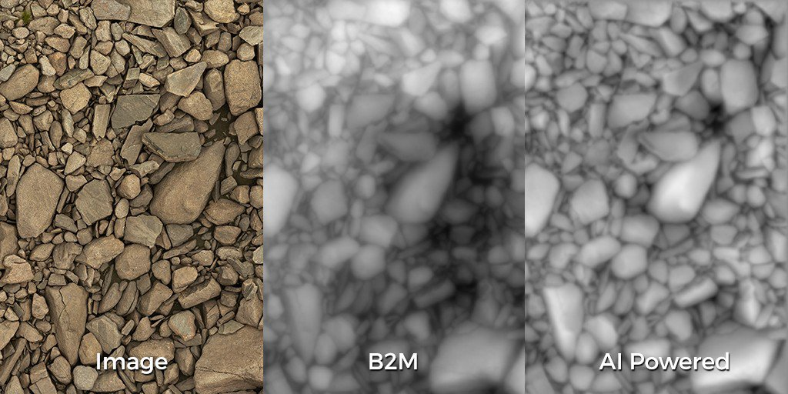
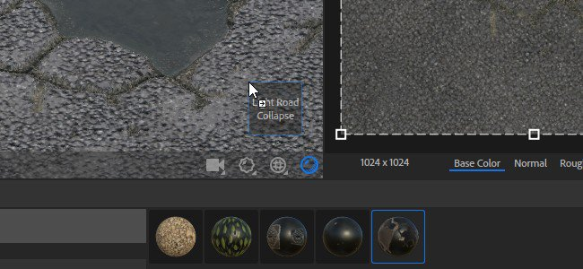

# 版本 2020.2（2.2）

**Substance Alchemist 2020.2「Udon」** 引入了全新的 AI 驅動影像轉材質流程，將單一影像輸入轉換為完整的 PBR 材質，並改良了材質創建範本，並有大量工作流程與可用性的改進，以及新增內容如新濾鏡。

發行日期： *2020年6月15日*

## 主要特色

### 影像轉材質（AI 驅動）

**Image to Material** 模板新增了一個名為 **AI Powered** 的新設定。此新設定能從單一輸入影像產生高品質 PBR 素材，效果更佳。

AI 驅動設定利用機器學習辨識形狀與物體，並準確生成高度與法線資訊。 此設定還包含 Delighter 濾鏡，用來去除陰影和高光。 這個新設定最適合戶外材質，因為演算法是以地面、卵石、樹皮、石頭及其他戶外表面，搭配自然光照明訓練的。 後續更新將帶來更多彈性與多樣性的支援材料。 更多細節請參閱 [專門的文件頁面](../../filters/tools/image-to-material.md)。

以下是兩個演算法產生的高度資訊與預設值的比較：

{width="800px"}

>[!NOTE]
>
> AI 驅動設定需要特定的硬體。 它僅支援搭載 Nvidia GPU 的 Windows 和 Linux。 更多資訊請參閱 [技術要求](../../getting-started/system-requirements.md) 。

### 新的材質匯入範本

圖片匯入彈出視窗在多個方面都有改進。 還有一種新的流程稱為 **Texture Import**。

* **改良介面**\
  介面已更新，使使用與學習更為簡便，並附有詳細說明每個選項。
* **新增材質匯入選項**\
  現在新增了一個名為 **Texture Import** 的選項，允許將一組圖片直接匯入並連接到正確的輸出通道，根據它們的名稱。 它提供了一個簡單的方法，可以從現有的影像群組中建立素材。 更多資訊請參閱 [專門的文件頁面](../../features-and-workflows/texture-import.md)。

### 新的 2D 繪圖濾鏡遮罩輸入

此版本現在可以直接在 2D 視圖中繪製和編輯濾鏡遮罩，無需匯入外部影像。 繪畫會自動鋪磚，使得材質無縫接通。

{width="450px"}

* **進入 2D 繪畫模式**\
  要啟動 2D 繪畫模式，只要點擊濾鏡屬性中遮罩名稱旁的筆刷圖示即可。

  
* **2D 繪圖工具列**\
  在繪圖模式下，2D 視圖會在頂部顯示一個新的工具列，具備以下功能：

  * **筆刷顏色**：調整遮罩時的畫筆灰階值。
  * **筆的大小**：調整遮罩時的筆量。
  * **重設遮罩**：將目前遮罩清除為黑色，任何繪畫資訊都會遺失。
  * **停止繪畫**：退出 2D 繪畫模式。

  
* **鍵盤快捷鍵**\
  繪畫模式支援以下快捷鍵以加快上色過程：

  * **X**：將筆刷目前的灰階值反轉。
  * **Ctrl + 滑鼠滾輪**：改變筆刷大小。
  * **[或]**：改變筆刷大小。

### 新的地圖集與貼紙創建模式捷徑

新增了兩種創建模式，以利用新型物質材質並簡化它們在層疊中的設置：

* **貼花模式**\
  **Alt + 拖放**：從收藏中拖放材質時，按住並按住 **Alt** 鍵，自動以貼花投影模式建立材質。
* **地圖集模式**\
  **Shift + 拖放**：從集合拖放素材時，按住並按住 Shift 鍵，自動在圖譜散佈模式下建立素材。

### 新視角修正工具

新增了一個名為 **透視修正** 的工具，可以調整或補償影像的透視。

* **透視校正**\
  透過此濾鏡，可以修正掃描和攝影影像的預設值，使其更適合素材創作。 濾鏡提供四個控制點，分別代表影像的初始角落。 移動點來調整或補償視角。

  

### 改良色彩小工具

參數面板中可見的顏色小工具現在提供了更多控制：

* **色彩值提示**\
  當滑鼠將滑鼠懸停在色彩小工具時，會出現一個工具提示，描述目前的色彩值（十六進位格式）。
* **右鍵點擊動作**\
  當右鍵點擊彩色小工具時，會出現一個新的情境選單，並包含以下操作：
  * **清除**：將顏色設為黑色，alpha 值設為零。
  * **複製：在**&#x200B;記憶體中複製元件目前的顏色值。
  * **貼上**：將記憶體中目前的顏色值貼到小工具中。

### 新內容

這個版本帶來了許多新穎且多元的內容：

* **新的預設網格**\
  現在有三種新的網格可用來展示視窗中的材質：
  * 鞋型
  * 男款T恤
  * 女性T恤
* **新濾鏡**\
  此版本新增了五種篩選器：
  * 裂紋
  * 苔蘚
  * 拼布縫法
  * 地板磚
  * PBR 驗證
* **新混合模式**
* 濾波器及其他工具現在支援一種名為 **Per Channel Blend 模式**&#x200B;的新混合模式。 啟用此模式後，可以在屬性面板中調整每個聲道的混合操作。
* **匯出預設**\
  此版本包含全新及更新的匯出預設：
  * VStitcher
  * CLO
  * Unity HDRP 範本中的 DetailMap 支援
