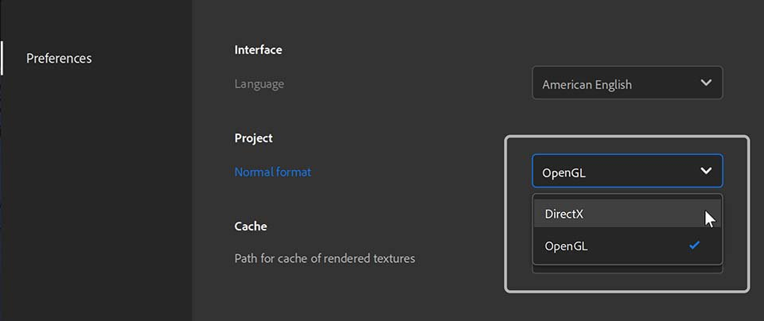

# 版本 3.1

Adobe Substance 3D Sampler 3.1 引入了新的色彩選擇器、支援 SVG 檔案，以及提升與 Stager、Photoshop 和 Illustrator 的互通性。

上映日期： *2021年9月28日*

## 主要特色

### 色彩選擇器

這次版本新增了 [選色器](../../interface/tools-and-widgets/color-picker.md) ，包含滴管和色片支援。

每當你需要選擇顏色時，顏色選擇器就會出現。 它可以在螢幕上移動到任何地方。

{width="250px"}

### SVG 支援

Sampler 現在支援 SVG 檔案。 你可以直接匯入素材、圖層堆疊，或是圖層的圖片輸入。

{width="500px"}

### 用 Illustrator 編輯

新增的「編輯入」功能為更新匯入圖片帶來極大的彈性。 如果你想調整 SVG 檔案，可以直接在 Illustrator 裡編輯檔案。 Sampler 會立即用新的 SVG 更新你的視覺效果。

### 全新裁切 UX/UI

Sampler 現在有了正式且重新設計的裁切小工具，可以輕鬆定義裁切區域。 將非正方形影像裁切成方形貼圖時，也不會得到拉伸的結果。

{width="500px"}

### 一般格式

編輯你的偏好設定，設定 [你工作流程所需的標準格式](../../interface/preferences/normal-format.md) 。 你的法線會匯入、顯示並匯出，依你在偏好設定中選擇的格式。

{width="250px"}

### SBSAR中的材料性質出口

著色器設定中的所有材質參數（正常縮放、高度縮放、高度等級,...） 會匯出到 SBSAR 檔案，讓 Substance 3D Stager 讀取，以達到完美材料匹配。

{width="500px"}

## 發行說明

### 3.1.0 Xocoalt

*（2021年9月28日發行）*

**補充：**

* [色彩選擇器]全新色彩選擇器使用者介面
* [色彩選擇器]預覽目前與過去的顏色並排
* [顏色選擇器]請以十六進制輸入你的顏色
* [色彩選擇器]新吸管帶色彩預覽
* [選色器]吸管可以在取樣器之外選顏色
* [色彩選擇器]在 RGB 或 HSV 色彩空間中調整你的顏色
* [色彩選擇器]儲存與管理色色
* [互通性]在 Illustrator 中從圖片匯入圖層或圖片參數編輯圖片
* [互通性]在 Photoshop 中從影像匯入圖層或影像參數編輯圖片
* [小工具]新作物小工具
* [小工具]按 Enter 鍵驗證你的作物
* [小工具]裁切小工具會讀取圖片大小以符合小工具，並在調整大小時保持比例
* [使用者介面]新的灰滑桿 UI
* [應用程式]在偏好設定中新增一般格式選擇
* [應用]影像匯入圖層中的標準格式遵循偏好設定中預設的標準格式
* [應用]在 2D 視圖中，法線會依照偏好設定的法線格式顯示
* [應用程式]正常值會以偏好設定的正常格式匯出
* [匯出]在 SBS 和 SBSAR 檔案匯出中加入一般格式參數
* [匯出]為 SBS 和 SBSAR 檔案匯出新增著色器設定
* [匯出]設定匯出後SBS圖表的預設解析度
* [複合濾波器]搭配 7z 的 SSA 濾波器
* [複合過濾器]在複合過濾器中加入類別元資料
* [複合濾波器]複合濾波器可以嵌入縮圖
* [複合過濾器]新增複合過濾器副檔名（.ssafilter）至「取得內容」檔案對話框
* [複合過濾器]在資產面板匯入複合過濾器（.ssafilter）
* [引擎]將物質引擎更新到v8.2.0

**修正：**

* [應用程式]連接的本地資料夾可能會掛機
* [申請]出口撞車
* [應用程式]啟動兩個 Sampler 實例時當機
* [內容]作物過濾器有隨機的種子調整
* [內容]有些物質材料有時不會升級
* [匯出]匯出新加入自訂預設時會當機
* [匯出]匯出彈窗中缺少估計包裹大小
* [匯出]在匯出 SBS 與 SBSAR 檔案時修正記憶體洩漏問題
* [複合濾波器]複合濾波器可能有重複輸入
* [複合濾波器]若濾波器有未被滿足的參考，則會崩潰
* [複合濾波器]在重新排序包含複合濾波器的圖層堆疊時會當機
* [複合濾鏡]渲染有時會卡住
* [圖片匯入]匯入圖片會觸發多個渲染
* [層疊]復原/重做時當機
* [層疊]加入基材時會崩潰
* [圖層]使用無效影像作為環境光時會當機
* [圖層]在插入包含多個圖表的濾波器時，修正重複匯入問題
* [層次]重新排列層次並不總是有效
* [專案]載入未完成專案檔案時當機
* [專案]開啟損壞專案時當機
* [專案]有些資產可能會從專案中消失
* [屬性]修正缺少濾鏡的預設
* [使用者介面]角度參數無法設定
* [使用者介面]篩選資產面板中顯示的元資料
* [使用者介面]依類別分組可隱藏篩選器
* [使用者介面]資產面板的捲動問題
* [使用者介面]匯出面板現在有滾動條
* [使用者介面]某些圖片格式的縮圖在圖片選擇器中不會顯示

**已知問題：**

* [即時引擎 2021]繁重的運算可能導致應用程式當機
* [即時引擎 2021]Realtime Engine 2021 會在同時安裝 AMD CPU 與 Nvidia GPU 的 Windows 電腦上當機
* [色彩選擇器]在另一個解析度不同的螢幕上選擇顏色可能無法運作
