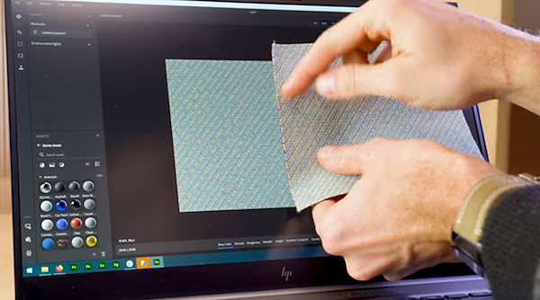

# 版本 3.2

**Substance 3D Sampler 3.2** 引入端到端的材料數位化工作流程，能捕捉並處理材料的物理尺寸，新增布織與通道切換等濾鏡，並具備建立自訂元資料的能力。

上映日期：2022年1月25 *日*

## 主要特色

### 實際大小

本版本引入了一套新的材料掃描工作流程，能捕捉並處理材料的物理尺寸。

在數位環境中，將樣本/影像的實際 [尺寸](../../features-and-workflows/end-to-end-physical-size-workflow.md) 相匹配，才能在任何軟體中創造出物理上精確的材料。

{width="400px"}

### 布織

本版本新增了全新的發電機。 布料織法讓你能創造並設計帶有客製化織法圖案的布料。

<table>
<tr style="border: 0;">
<td style="border: 0;" valign="top">

{width="390px"}

</td>
<td style="border: 0;" valign="top">

{width="400px"}

</td>
</tr>
</table>

### 自訂元資料

為你的素材加入自訂元資料。 所有自訂的元資料都會包含在材料檔案（SBSAR）中，以確保跨應用程式共享數位資料的工作流程更有效率。

{width="264px"}

### 頻道切換

有了 Channel Switch，你現在可以切換素材輸出映射的通道。

{width="300px"}

### 匯出

本版本新增了匯出功能。

* 設定 .sbsar 檔案壓縮設定

  {width="400px"}
* 匯出 .sbs（ar） 檔案時請設定圖表類型
* 保持 EXR、JPEG、PNG、TARGA、TIFF 的物理比例

  {width="400px"}

## 發行說明

### 3.2.0 燒鳥

*（2022年1月25日發行）*

**補充：**

* [實體尺寸]新的實體尺寸面板
* [實體尺寸]在材質建立範本視窗中新增實體尺寸選項
* [實體尺寸]新增實體尺寸測量工具
* [實體尺寸]新增實體尺寸自動測量工具
* [實體尺寸]新增實體尺寸診斷工具
* [實體尺寸]允許設定物理尺寸的 z 值
* [實體尺寸]下拉小工具可設定2D視圖的縮放等級
* [實體尺寸]縮放等級下拉選單新增「與物理比例顯示」選項
* [實體尺寸]縮放下拉選單中新增的「合適於實體尺寸」選項
* [實體尺寸]在2D視圖中顯示實體尺寸
* [實體尺寸]在3D視窗中顯示實體尺寸
* [實體尺寸]在影像匯入對話框中，若有匯入高度圖，請顯示實體尺寸深度
* [實體尺寸]在資產情境選單中顯示實體尺寸
* [實體尺寸]在偏好設定中設定長度單位
* [實體尺寸]尊重物理比例的出口材質
* [元資料]能夠為使用者自創的資產新增自訂元資料
* [匯出]將自訂元資料匯出為 .sbs（ar） 檔案
* [匯出]將描述、分類、作者及標籤元資料匯出至 .sbs（ar） 檔案
* [匯出]將實體大小匯出為 .sbs（ar） 檔案
* [匯出]設定 .sbsar 檔案壓縮設定
* [匯出]將資產縮圖匯出為 .sbs（ar） 檔案
* [匯出]匯出 .sbs（ar） 檔案時設定圖表類型
* [應用程式]Realtime Engine 2021 已不再提供
* [應用程式]復原/重做現在支援平鋪（U、V）及高度縮放滑桿變更
* [渲染中]當作者資產被儲存時，產生磁碟快取
* [資產]使用 Ctrl+Click 在資源面板中啟用多種資產類型篩選
* [使用者介面]鎖定平鋪（U，V）滑桿的功能
* [使用者介面]新增一個包含「複製」、「剪切」、「貼上」、「全部複製」及「全部剪切」的上下文選單
* [使用者介面]長度單位（公尺、英吋、秒差距等） 標籤與文字欄位支援
* [使用者介面]使用者可以設定用於顯示數字的十進位精度
* [使用者介面]在所有相關的小節彈出視窗中使用單位
* [本地化]預設的新資產名稱現已本地化
* [內容]新布織產生器
* [內容]新頻道切換濾波器
* [內容]所有相關過濾器現在都已知物理尺寸
* [內容]木製漆的新圖示
* [內容]所有濾鏡現已相容於 Adobe 標準材質（ASM）頻道
* [內容]過濾器現在可以有「環境」變化

**修正：**

* [2D 視圖]移除後頻道仍留在列表中
* [應用程式]無法複製從作業系統檔案總管載入的資產
* [申請]出口撞車
* [應用程式]有時點擊「Starter Assets」面板中的「Starter Assets」會當機
* [應用]刪除素材時發生崩潰
* [應用程式]環境變數「SUBSTANCE\_DISABLE\_SPECIFIC\_FEATURES」在設定為「0」或「」時仍然有效。
* [應用]在儲存包含多種材料的專案時凍結
* [應用程式]匯入映像檔可能導致當機
* [申請]首次推出時缺少一些起始資產
* [匯出]匯出資產有時會導致崩潰
* [圖層]當圖層面板關閉或不可見時，無法匯入圖片
* [層]改變語言會使目前資產重新計算
* [圖層]更改匯入影像的使用方式不會更新使用哪種濾鏡變體
* [圖層]在調整下方圖層時，有時無法計算影像到材質（AI）
* [圖層]影像到材質（AI）有時會在不需要時重新計算
* [圖層]當磁碟上更新自訂過濾器時，不建議更新
* [圖層]正常通道有時會有錯誤的像素格式
* [層]即使不可見，某些層仍會被計算
* [圖層]切換圖層可見性時，2D 視圖工具可能會失效
* [圖層]使用影像與材質（AI）時，介面會凍結
* [圖層]切換轉換濾鏡層的可見性會破壞 2D 視圖工具，可能導致當機
* [層]從層堆疊中移除一層時，重複計算次數過多
* [層]當複合濾波器包含不尋常或自訂的輸入/輸出時，Sampler 不會計算該輸入/輸出
* [表演]資產面板開啟緩慢
* [效能]避免對層堆疊進行不必要的重新計算
* [效能]載入專案資產耗時太長
* [效能]磁碟上的渲染快取不可使用
* [效能]層級切換很慢
* [性能]調整材料或過濾器速度較慢
* [專案]退出時儲存專案可能會導致車禍
* [渲染中]移除影像可能會移除所有輸出
* [渲染中]調整視窗中顯示的渲染時間是錯誤的
* [使用者介面]在匯出彈窗中無法在需要時垂直捲動
* [使用者介面]當沒有可匯出內容時，可以打開匯出彈窗
* [使用者介面]有些彈出視窗如果內容溢出，則不會捲動
* [使用者介面]點擊或開啟選單時，文字欄位不會被選取
* [使用者介面]屬性面板中混合模式的名稱有時不正確
* [使用者介面]檔案選單中的儲存選項有時會顯示灰色
* [使用者介面]重新命名兩個材料後，文字欄位不會消失
* [使用者介面]偏好設定彈出視窗有錯字

**已知問題：**

* [色彩選擇器]在另一個解析度不同的螢幕上選擇顏色可能無法運作
