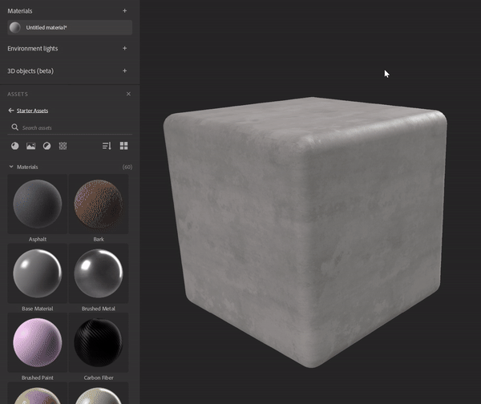
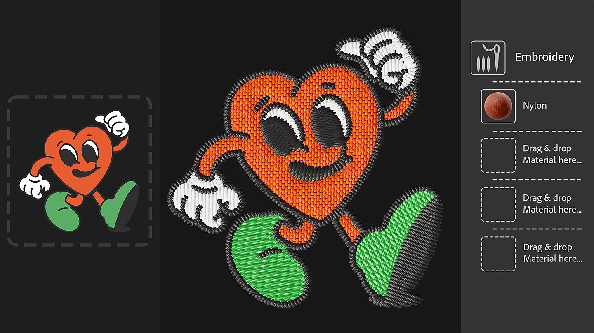

# 版本 4.3

<b>Substance 3D Sampler 4.3</b> 引入了新的入門內容，包括 <b>材質產生器</b>、新版 <b>刺繡</b> 濾鏡，以及 <b>一個 Perpective 裁剪</b> 工具。

*上映日期：2024年1月25日*

## 全新入門資產內容

Sampler 所附的材料已更新，以更好地滿足工業設計</b>、<b>時尚</b>工作流程，<b>以及媒體與娛樂領域的技術藝術家，現在能更掌控製作材質的技術層面。

## 貼圖產生器

新的材質產生器透過參數化噪音、圖案</b>和<b>垃圾</b>搖滾選項，提供更好的材質製作<b>控制。生成的影像可用於遮罩或頻道地圖，讓技術與創意團隊比以往更容易合作進行材質設計。

使用新的篩選圖示來解析只解析材質產生器。

## 刺繡

更新後的刺繡濾鏡提升了縫製精度，並支援最多8種顏色。 材料的輸入回到層堆疊中，使得在補丁中插入其他計量元素成為可能。

## 透視裁切

新的透視裁切工具允許你裁剪扭曲材質和掃描，並用四個控制點移除透視瑕疵，並獲得可平鋪的資產。

## 風格化

風格化濾鏡允許你為任何材質做造型，達到手繪效果。

## 填充濾鏡中的混合模式

填充濾波器的升級引入了混合模式，讓你可以將填充的值、輸入貼圖或材質產生器與下方圖層的通道結果相乘。

## 影像匯入圖層改進

你可以新增匯入影像圖層，並從影像的 Alpha 通道產生不透明度貼圖。

## 發行說明

*（發行日期：2024年1月25日）*

<b>補充</b>：

* [資產]新資產類型：材質產生器
* [資產]入門資產中包含的新材料
* [資產]屬性面板中新增的影像參數資產選擇器
* [資產]將材質產生器從資產面板拖放到屬性面板的圖片選擇器
* [資產]從作業系統檔案總管拖放材質產生器
* [資產]過濾器可透過影像輸入的使用者標籤建議擬合產生器
* [資產]材質產生器可以透過使用者標籤來定義應該推薦的濾鏡
* [內容]新透視裁切濾鏡
* [內容]新風格化過濾器
* [內容]填充濾波器的混合模式
* [內容]更新的刺繡濾鏡
* [內容]更新的油漆包裝濾鏡
* [內容]已更新所有濾鏡以支援貼圖產生器
* [圖層]在將材質產生器加入圖層堆疊時，能夠選擇輸出通道
* [圖層]能夠輕鬆地在材質產生器上列出並套用預設
* [圖層]在圖片選擇器中顯示材質產生器的預覽
* [圖層]貼圖產生器的參數可以被曝光並匯出
* [圖層]在用貼圖匯入建立範本匯入單一圖片時，指定基礎色彩的使用方式
* [圖層]在屬性面板中嘗試拖放不相容檔案時的反饋
* [圖層]從匯入影像的 alpha 通道產生不透明度通道
* [圖層]影像到材質（AI）在更改其類別時計算速度更快
* [圖層]使用建立範本後，選擇最相關的圖層
* [圖層]現在可以在進階參數群組中用滑桿調整位置小工具
* [匯出]在佇列中顯示百分比，而非原始數字
* [互通性]不透明度通道在傳送給 Painter 時，現在被識別為 alpha 通道
* [應用程式]新增顯示與儲存硬體資訊的對話框
* [應用]新增偏好，為每個專案更改預設高度比例
* [應用]改善過時資產的展示方式
* [腳本]新的 asset.documentResolution（） 與 asset.setDocumentResolution（） 函式
* [腳本操作]新的 select\_asset（） 函式
* [腳本]Python 材質產生器 API
* [腳本] get\_project\_assets（） 現在回傳 3D 物件
* [使用者介面]資產縮圖大小可在資產面板中更改
* [使用者介面]更新的視窗顯示圖示

<b>修正：</b>

* [2D 視角]滑鼠滾輪的縮放被阻擋在 244%
* [應用程式]初始化圖形 API 時會當機
* [應用程式]若專案名稱包含 # 字元，則當機
* [應用程式]開啟舊專案時可能當機
* [申請]重新開啟現有專案可能導致崩盤
* [應用程式]部分專案變更未被登錄，若未儲存，關閉專案時會無預警遺失
* [匯出] .sbs/.sbsar 在使用多個同名檔案時匯出問題
* [匯出]匯出灰階影像的色彩空間錯誤 .sbs/.sbsar 檔案
* [濾鏡]不透明度混合行為問題
* [圖層] .svg檔案有時不會以正確解析度呈現
* [效能]有些專案存檔在磁碟上是不必要的
* [專案]匯入舊專案不會載入相關的預設
* [腳本]無法取得第一層插入的參數
* [使用者介面]當滑鼠滑鼠移到資產時，預覽彈窗可能會出現在錯誤的位置或畫面
* [使用者介面]未接入的面板可在歡迎畫面上方顯示並可用
