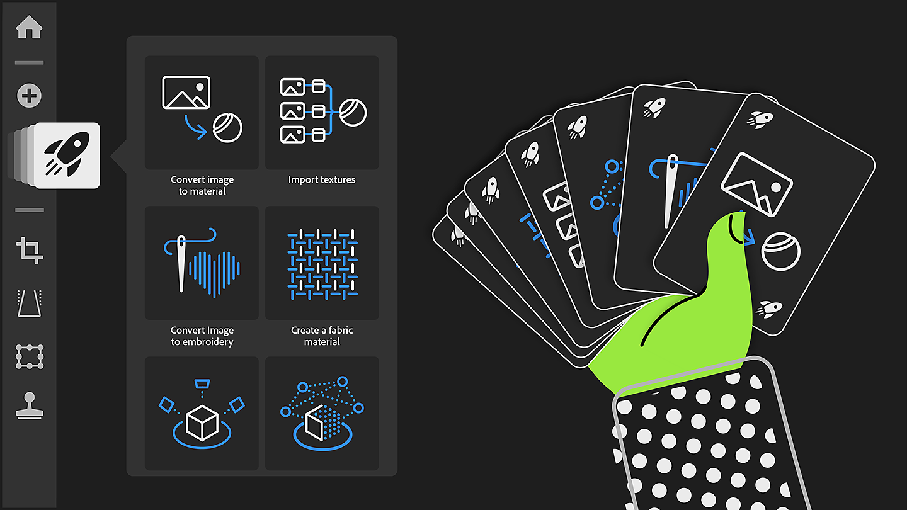

# 版本 5.0

<b>Substance 3D Sampler 5.0</b> 引入了更簡便的方式，透過高品質的掃描與渲染，讓玩家能更輕鬆地進入素材數位孿生。

主要新功能包括：

## 快速動作

一鍵啟動 Sampler 的所有主要工作流程，並準備好圖層堆疊！

更多資訊 *[請見此](../interface/panels/quick-actions-panel.md)*&#x200B;處。

## 新的主畫面佈局

找到所有專案、教學，直接從首頁開始你的工作。

更多資訊 *[請見此](../interface/the-home-screen.md)*&#x200B;處。

## 新渲染器

可選擇即時與路徑追蹤，提升視覺一致性並支援新的材料特性。 直接從 3D 視圖儲存作品快照。

更多資訊 *[請見此](../interface/2d-and-3d-viewport.md)*&#x200B;處。

## HP Z Captis 整合

透過 HP Z Captis 與 Substance 3D Sampler，將真實材料數位化，只需數分鐘。

此功能適用於企業、Teams 及教育帳戶。

更多資訊 *[請見此](../pipeline-and-integrations/hp-z-captis-support/hp-z-captis-support.md)*&#x200B;處。

## V5.0 發行說明

*（發行日期：2025年2月20日）*

<b>補充</b>：

* [入職中]全新首頁，提供快速存取學習內容、範例專案、快速行動及近期專案。
* [入職中]快速開始使用新的快速操作功能，可從首頁及專用面板存取
* [上線][內容]快速動作是預先定義的工作流程，會將最常用的圖層填充到層堆疊中
* [入職中]可透過新的快速開始選單、快速動作或自訂專案建立新專案
* [啟動中]可透過專用按鈕直接從首頁建立空專案
* [3D 視角]新型先進光柵化器與路徑追蹤器帶來新的渲染能力（如塗層、光澤、半透明、次表面散射等特性）及 Substance 生態系統中的視覺一致性
* [3D 視圖]檢視器設定現在可直接在 3D 視圖中存取
* [3D 視角]可將渲染快照儲存在剪貼簿或檔案中
* [3D 視圖]顯示格子以視覺化場景原點
* [3D 視角]啟用地面平面捕捉陰影與反射
* [3D 視角]控制你的地面平面的反射和不透明程度
* [3D 擷取]地面位置網格
* [應用程式]啟動應用程式時檢查硬體相容性
* [應用程式]當機報告視窗現在會在當機發生後立即開啟
* [內容]開啟範例專案即可輕鬆開始
* [匯出]匯出 Adobe Standard 材質著色器（USD）檔案
* [生成式 AI]在影像轉紋理工作流程中使用影像作為輸入時，請檢查「請勿推論」標籤
* [專案]縮圖會儲存在專案檔案中，以便更快開啟專案
* [專案]在偏好設定中設定在專案檔案中儲存快取資料，並有不同模式（無快取、輕快取、完整快取）
* [腳本操作][破壞性變更]Qt 遷移至 Qt6.15 - 影響現有外掛的相容性
* [腳本操作]預設的外掛和腳本資料夾現在都放在 Documents 資料夾裡
* [腳本]新增插件介面，與主取樣面板視覺一致
* [腳本操作]存取 2 個插件範例以發掘取樣器插件的功能
* [腳本播放]新的開啟\_3d\_catpure（）函式
* [腳本操作]插入圖層時，控制該圖層是插入在目標位置上方還是下方

<b>修正：</b>

* [3D 擷取]若無法在 macOS 上啟動物件擷取，則當機
* [申請]出口撞車
* [應用程式]在出口停留，同時將資產加入專案面板
* [應用程式]除非你按下 Enter 鍵，否則無法重新命名專案資產
* [應用程式]復原與重做選單項目未被禁用，但該被禁用
* [資產]無法從資產面板的「所有函式庫」區塊刪除資產
* [內容]地圖集建立器 - 如有不透明度地圖，請使用現有的不透明度地圖
* [內容]色彩識別混合 - 修正基色中的顏色選擇問題
* [層]使用生成器時避免不必要的計算
* [層次]調整產生器可能會導致觸發過多計算
* [效能]改善 GPU 記憶體管理
* [效能]重新啟動應用程式時，渲染快取可能不會被使用
* [資源]唯讀檔案在資產面板中無法顯示
* [腳本]新增一層後允許重複使用一層
* [腳本]在同一腳本中多次更改層堆疊結構可能會失敗

<b>已移除：</b>

* [應用程式]移除對 .dng 和 .nef 影像檔的支援
