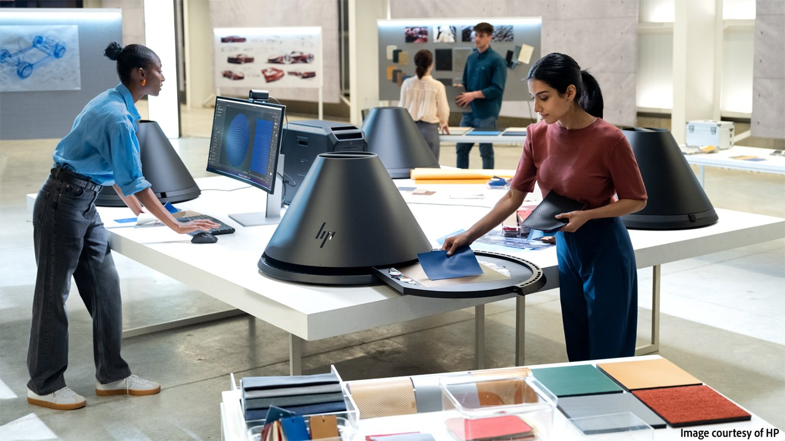

# 版本 5.1

在 Substance 3D Sampler 5.1</b> 中，使用全新且改良的工具<b>，縮短捕捉素材與匯出數位孿生之間的時間！

主要新功能包括：

## 磁磚自動結構化材質

透過自動生成無縫磁磚，節省處理結構化或圖案材料（如布料）的時間。

更多資訊 *[請見此](../filters/tools/auto-tiling.md)*&#x200B;處。

## 高效層級工作流程

透過轉換堆疊層，提升效能並縮短計算時間，透過轉換堆疊層，形成統一圖層內的單一映射集合。 重新命名並複製它們以提升效率！

更多資訊 *[請見此](../features-and-workflows/flatten-layers.md)*&#x200B;處。

## 強大的掃描處理工具

透過強化的Equalize與Clone Stamp濾鏡，以及新的布料自動摺疊去除功能，無論材質多複雜，你都能在幾次點擊內完成完美掃描。

## 強化版 HP Z Captis 支援

現在有了 Roughness 地圖生成和 Studio 模式的自動物理尺寸偵測，你能獲得比以往更細緻且精確的材質數位孿生！

## V5.1 發行說明

*（發行日期：2025年8月7日）*

## 補充：

* [2D 視角]畫筆大小現在會根據目前的材質解析度調整
* [3D 視圖]在偏好設定中切換 3D 渲染的原生顯示縮放
* [應用程式]渲染引擎更新
* [Captis]預覽時新增「make square」選項
* [Captis]自動物理尺寸偵測
* [Captis]捕捉新物質將創造新資產
* [Captis]在下拉選單中將解析度選擇改為像素每英吋或公分，而非最大面積的像素解析度
* [Captis]校準校正的上下文協助
* [Captis]生成粗糙度地圖
* [Captis]如果預設校準檔遺失，請警告使用者
* [濾波器]結構材料與掃描自動平鋪濾波器
* [濾網]新摺痕去除濾網
* [過濾器]複製印章過濾器的新功能
* [過濾器]Equalize 過濾器中的新功能
* [層次]能夠壓平層次
* [圖層]右鍵點擊圖層時，右鍵選單可重新命名、複製、刪除或壓平該圖層
* [入職過程]更新：歡迎與最新資訊螢幕內容
* [效能]使用裁切濾鏡時效能更佳
* [效能]改善 3D 視圖的記憶體使用率
* [表演]更新3D視角更快
* [實體尺寸]在使用實體尺寸時，啟用「物理比例顯示」功能。
* [實體尺寸]在空堆疊中匯入影像時，建議一個與影像比例更為一致的解析度
* [快速操作] 掃描處理新增3個快速動作
* [腳本]API來平整圖層
* [腳本操作]取得每個影像匯入圖層的檔案名稱
* [腳本]新功能用於啟動/停用資產的特定通道
* [使用者介面]重新設計圖示面板中的圖示與按鈕，以配合新功能
* [使用者介面]警告環境燈光製作功能會被棄用

## 修正：

* [2D 視角]選擇「以物理比例顯示」可能無法使用物質過濾器
* [3D 擷取]svg 檔案會列在檔案選擇器中，但不支援
* [3D 視角]著色器設定中的發射強度參數無法運作
* [3D 視角]有時建立新資產時，網格位置會不正確
* [3D 視圖]切換到路徑追蹤渲染在不支援的硬體上會當機
* [應用程式]當關閉手動量表彈窗且未設定尺寸時，應用程式會卡住
* [申請]撞擊
* [應用程式]顯示桌面時（Windows 鍵 + D 鍵快捷鍵）在 Windows 上凍結
* [應用程式]切換語言時可能當機
* [Captis]當預覽資料無效時會當機
* [Captis]放大後無法完全拉遠
* [Captis]有些巫師步驟缺少定位
* [Captis]使用Captis時可能在出口墜毀
* [Captis]如果裝置缺少校正檔案，掃描就無法運作
* [濾鏡]使用 Clone Stamp 濾鏡時，筆刷預覽可能會因材質和筆刷大小而有誤
* [濾波器]使用升頻濾波器後輸出大小錯誤
* [濾鏡]缺少環境旋轉與風格化濾鏡的圖示
* [濾鏡]更新部分濾鏡可能導致錯誤渲染
* [圖層]混合兩種材質時，首次渲染錯誤
* [圖層]更新圖層的按鈕顯示「全部更新」，即使只有一次更新
* [圖層]在圖層堆疊中匯入影像時，出現不必要的計算
* [效能]改進法線貼圖格式處理以縮短渲染時間
* [實體尺寸]手動測量彈窗只有在自動測量後才會生效
* [實體尺寸]啟用實體尺寸時，匯出彈窗的匯出解析度錯誤
* [快速操作]生成的資產名稱缺少本地化
* [使用者介面]懸停資產預覽可能不會顯示
* [使用者介面]點擊「重置為預設值」按鈕可能會破壞部分控制功能
* [使用者介面]切換專案時錯誤訊息不會被清除
* [使用者介面]當沒有資產時，確保視口和屬性面板中的材質名稱為空
* [使用者介面]視角參數的預設值重置按鈕無法運作
* [使用者介面]重置為預設值，按鈕重疊
* [使用者介面]面板脫離底座時，有些按鈕無法點擊
* [使用者介面]貼圖耕耘 V 參數部分隱藏於檢視器設定與 3D 視圖中

## 已移除：

* [3D 擷取]移除 3D 擷取支援
* [應用程式]移除 macOS x86 支援
